Analysis of SG Flight data
====

## Introduction
We investigate recently released passenger entry count into Singapore.


## Exploratory analyses
We investigate how passenger numbers fluctuate in terms of 

1. Months
2. Months and Years

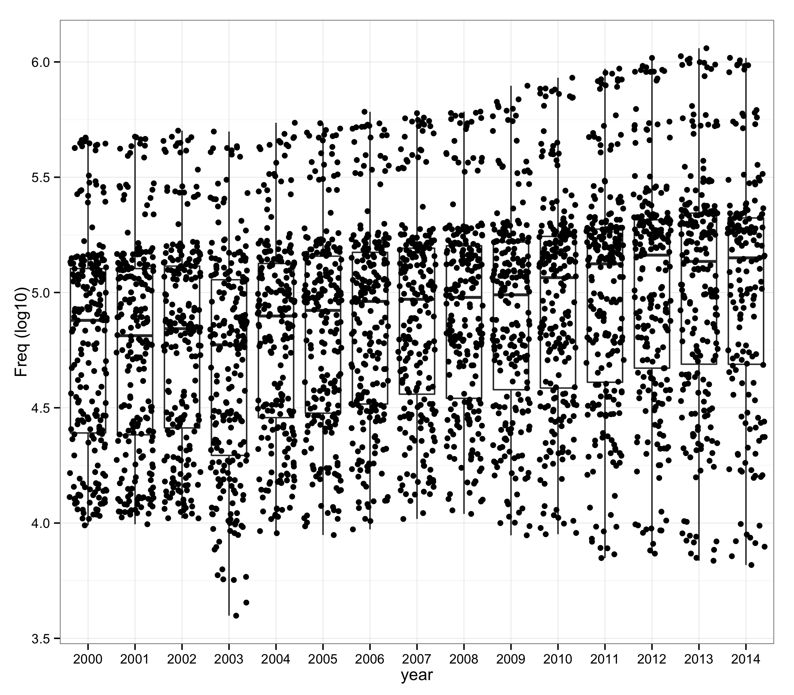 <center><p class="caption"><b>Fig</b>: Boxplots showing human traffic grouped by month</p></center>

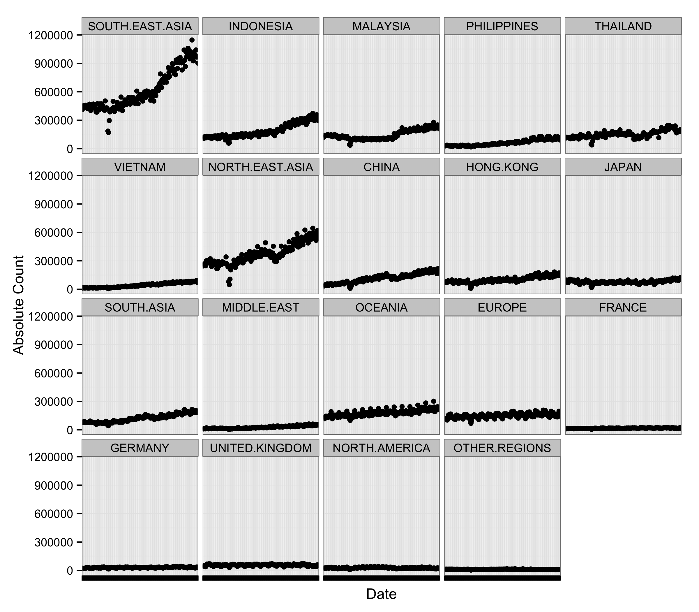 <center><p class="caption"><b>Fig</b>:Same Y scale</p></center>
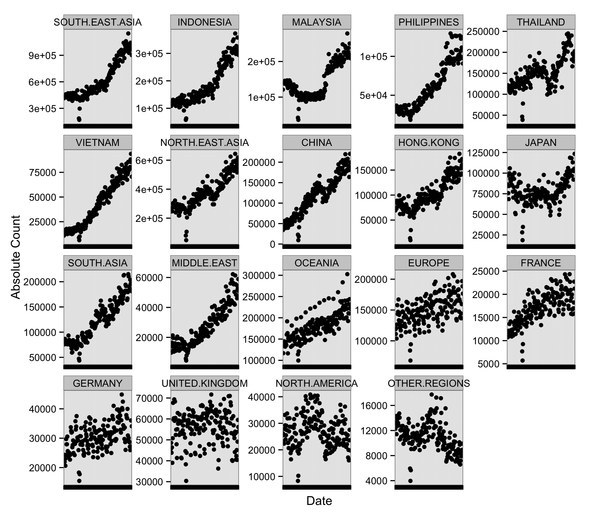 <center><p class="caption"><b>Fig</b>: Free scale</p></center>

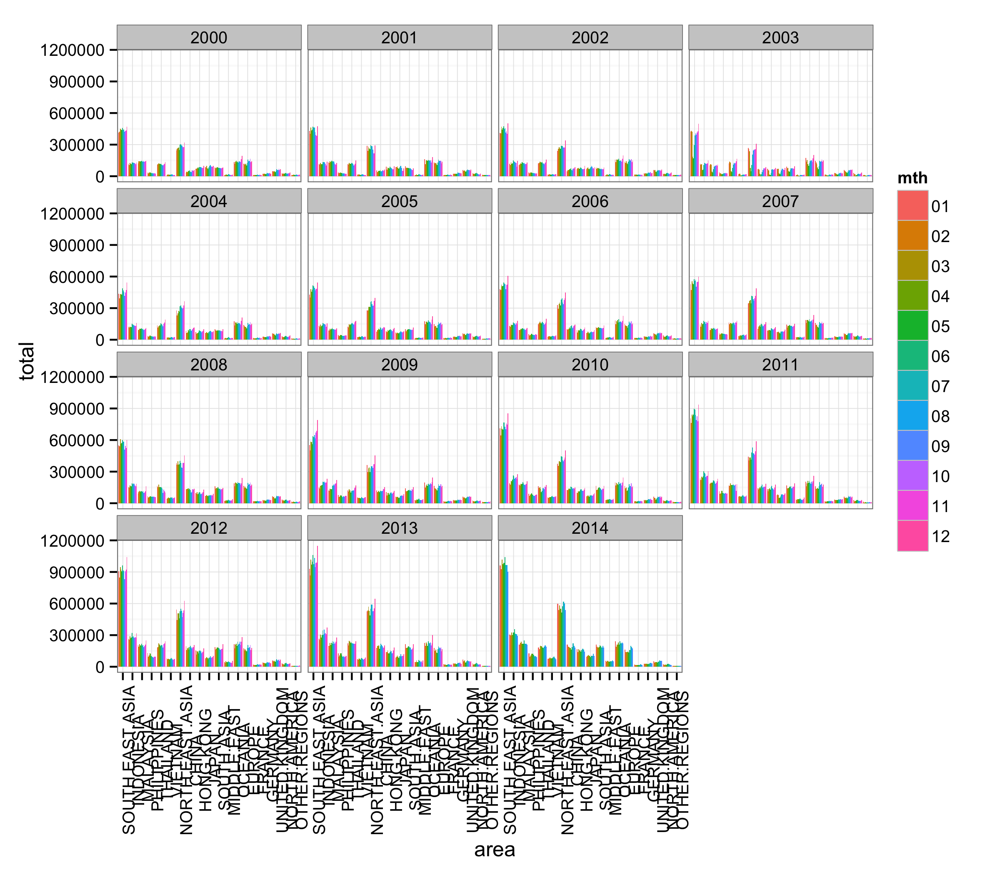 <center><p class="caption"><b>Fig</b>: Grouped by Year</p></center>

## Quantile Normalisation
We proceed to normalise the data, by manipulating the data.points to have the same quantiles.


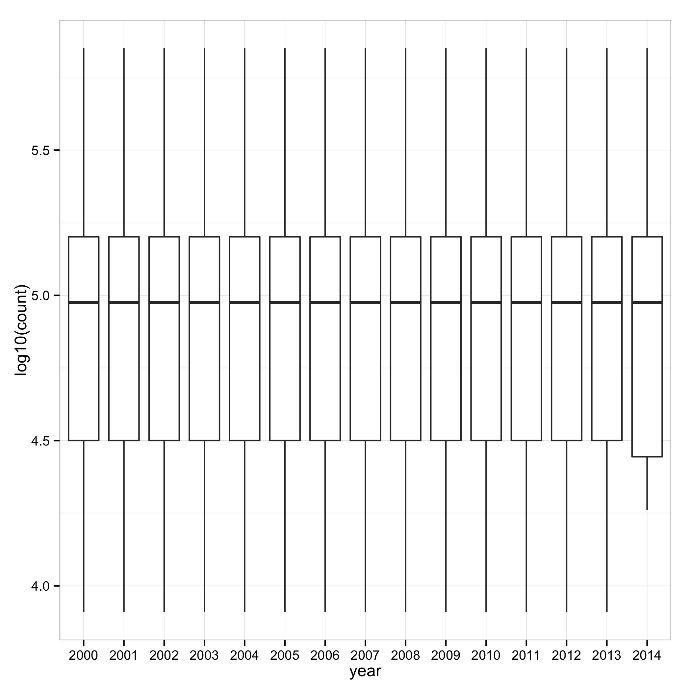 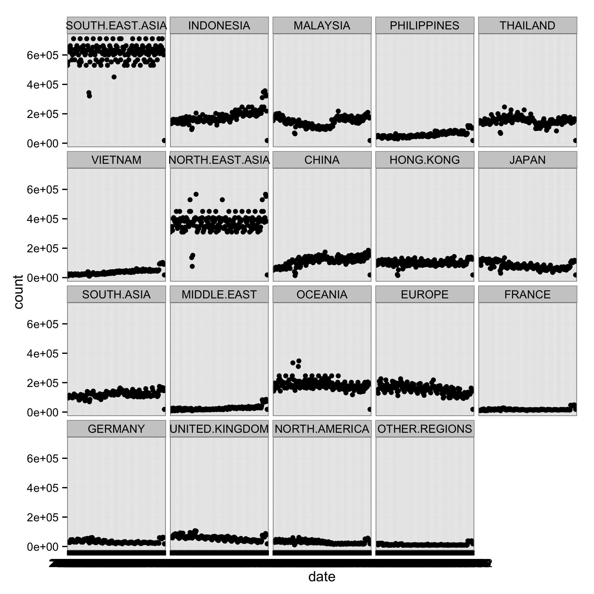 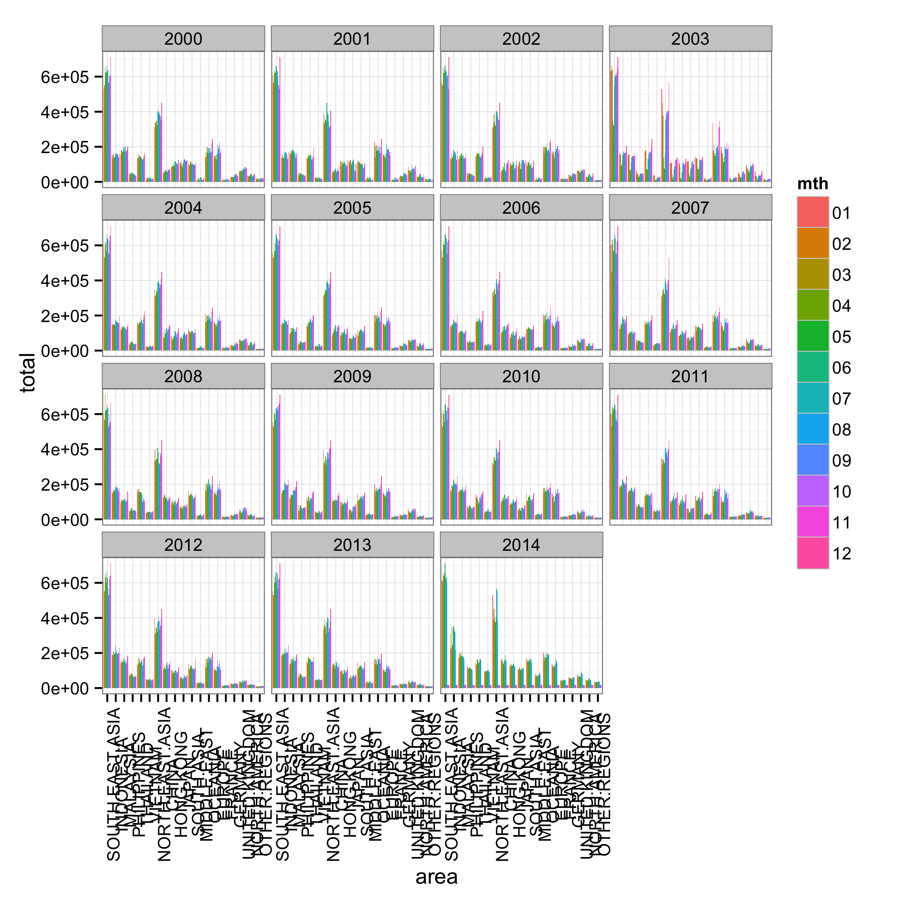 <center><p class="caption"><b>Fig</b>: Free scale</p></center>
## Clustering

We proceed next with clustering the regions,
from which these passengers arrive into groups 
based on how similar they are in terms of their frequencies.

### 1. Hierarchical Clustering

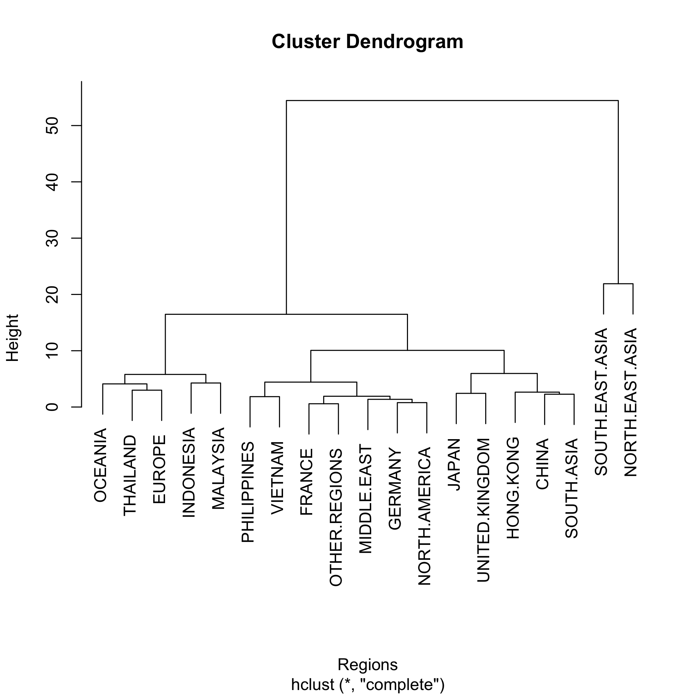 
### 2. K-means

We plot the elbow plot where we plot the within cluster sum of squares *K*.


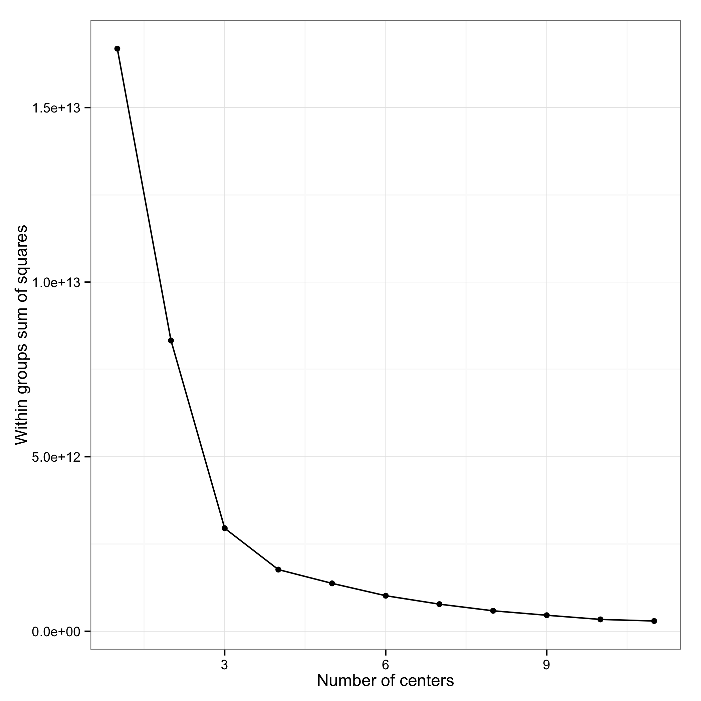 <center><p class="caption"><b>Fig</b>: Elbow plot</p></center>

From the graph, we see that the best k is 5.


```
##       INDONESIA        MALAYSIA     PHILIPPINES        THAILAND 
##               1               1               1               1 
##         VIETNAM NORTH.EAST.ASIA           CHINA       HONG.KONG 
##               1               1               1               1 
##           JAPAN      SOUTH.ASIA     MIDDLE.EAST         OCEANIA 
##               1               1               1               1 
##          EUROPE          FRANCE         GERMANY  UNITED.KINGDOM 
##               1               1               1               1 
##   NORTH.AMERICA   OTHER.REGIONS 
##               1               1
```

Presenting each cluster as a group in the network.

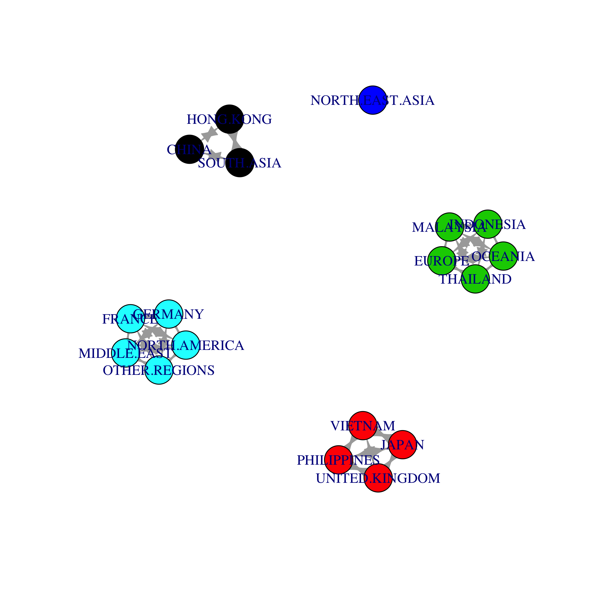 

### Singular Vector Decomposition

Finally, we apply SVD to the the data and look for the overarching patterns.

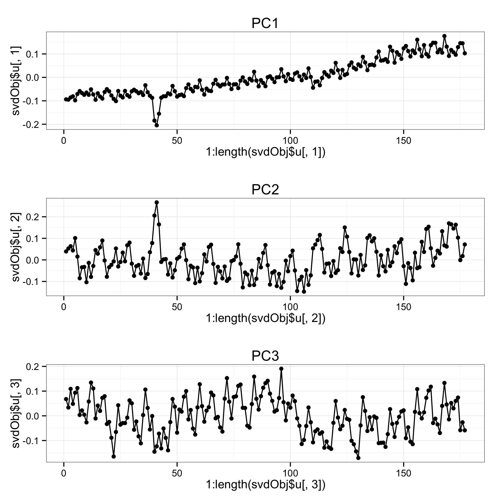 <center><p class="caption"><b>Fig</b>: PC1</p></center>

<script src="CanvasMatrix.js" type="text/javascript"></script>
<canvas id="unnamed_chunk_15textureCanvas" style="display: none;" width="256" height="256">
Your browser does not support the HTML5 canvas element.</canvas>
<!-- ****** points object 45 ****** -->
<script id="unnamed_chunk_15vshader45" type="x-shader/x-vertex">
attribute vec3 aPos;
attribute vec4 aCol;
uniform mat4 mvMatrix;
uniform mat4 prMatrix;
varying vec4 vCol;
varying vec4 vPosition;
void main(void) {
vPosition = mvMatrix * vec4(aPos, 1.);
gl_Position = prMatrix * vPosition;
gl_PointSize = 10.;
vCol = aCol;
}
</script>
<script id="unnamed_chunk_15fshader45" type="x-shader/x-fragment"> 
#ifdef GL_ES
precision highp float;
#endif
varying vec4 vCol; // carries alpha
varying vec4 vPosition;
void main(void) {
vec4 colDiff = vCol;
vec4 lighteffect = colDiff;
gl_FragColor = lighteffect;
}
</script> 
<!-- ****** text object 47 ****** -->
<script id="unnamed_chunk_15vshader47" type="x-shader/x-vertex">
attribute vec3 aPos;
attribute vec4 aCol;
uniform mat4 mvMatrix;
uniform mat4 prMatrix;
varying vec4 vCol;
varying vec4 vPosition;
attribute vec2 aTexcoord;
varying vec2 vTexcoord;
uniform vec2 textScale;
attribute vec2 aOfs;
void main(void) {
vCol = aCol;
vTexcoord = aTexcoord;
vec4 pos = prMatrix * mvMatrix * vec4(aPos, 1.);
pos = pos/pos.w;
gl_Position = pos + vec4(aOfs*textScale, 0.,0.);
}
</script>
<script id="unnamed_chunk_15fshader47" type="x-shader/x-fragment"> 
#ifdef GL_ES
precision highp float;
#endif
varying vec4 vCol; // carries alpha
varying vec4 vPosition;
varying vec2 vTexcoord;
uniform sampler2D uSampler;
void main(void) {
vec4 colDiff = vCol;
vec4 lighteffect = colDiff;
vec4 textureColor = lighteffect*texture2D(uSampler, vTexcoord);
if (textureColor.a < 0.1)
discard;
else
gl_FragColor = textureColor;
}
</script> 
<!-- ****** text object 48 ****** -->
<script id="unnamed_chunk_15vshader48" type="x-shader/x-vertex">
attribute vec3 aPos;
attribute vec4 aCol;
uniform mat4 mvMatrix;
uniform mat4 prMatrix;
varying vec4 vCol;
varying vec4 vPosition;
attribute vec2 aTexcoord;
varying vec2 vTexcoord;
uniform vec2 textScale;
attribute vec2 aOfs;
void main(void) {
vCol = aCol;
vTexcoord = aTexcoord;
vec4 pos = prMatrix * mvMatrix * vec4(aPos, 1.);
pos = pos/pos.w;
gl_Position = pos + vec4(aOfs*textScale, 0.,0.);
}
</script>
<script id="unnamed_chunk_15fshader48" type="x-shader/x-fragment"> 
#ifdef GL_ES
precision highp float;
#endif
varying vec4 vCol; // carries alpha
varying vec4 vPosition;
varying vec2 vTexcoord;
uniform sampler2D uSampler;
void main(void) {
vec4 colDiff = vCol;
vec4 lighteffect = colDiff;
vec4 textureColor = lighteffect*texture2D(uSampler, vTexcoord);
if (textureColor.a < 0.1)
discard;
else
gl_FragColor = textureColor;
}
</script> 
<!-- ****** text object 49 ****** -->
<script id="unnamed_chunk_15vshader49" type="x-shader/x-vertex">
attribute vec3 aPos;
attribute vec4 aCol;
uniform mat4 mvMatrix;
uniform mat4 prMatrix;
varying vec4 vCol;
varying vec4 vPosition;
attribute vec2 aTexcoord;
varying vec2 vTexcoord;
uniform vec2 textScale;
attribute vec2 aOfs;
void main(void) {
vCol = aCol;
vTexcoord = aTexcoord;
vec4 pos = prMatrix * mvMatrix * vec4(aPos, 1.);
pos = pos/pos.w;
gl_Position = pos + vec4(aOfs*textScale, 0.,0.);
}
</script>
<script id="unnamed_chunk_15fshader49" type="x-shader/x-fragment"> 
#ifdef GL_ES
precision highp float;
#endif
varying vec4 vCol; // carries alpha
varying vec4 vPosition;
varying vec2 vTexcoord;
uniform sampler2D uSampler;
void main(void) {
vec4 colDiff = vCol;
vec4 lighteffect = colDiff;
vec4 textureColor = lighteffect*texture2D(uSampler, vTexcoord);
if (textureColor.a < 0.1)
discard;
else
gl_FragColor = textureColor;
}
</script> 
<!-- ****** text object 50 ****** -->
<script id="unnamed_chunk_15vshader50" type="x-shader/x-vertex">
attribute vec3 aPos;
attribute vec4 aCol;
uniform mat4 mvMatrix;
uniform mat4 prMatrix;
varying vec4 vCol;
varying vec4 vPosition;
attribute vec2 aTexcoord;
varying vec2 vTexcoord;
uniform vec2 textScale;
attribute vec2 aOfs;
void main(void) {
vCol = aCol;
vTexcoord = aTexcoord;
vec4 pos = prMatrix * mvMatrix * vec4(aPos, 1.);
pos = pos/pos.w;
gl_Position = pos + vec4(aOfs*textScale, 0.,0.);
}
</script>
<script id="unnamed_chunk_15fshader50" type="x-shader/x-fragment"> 
#ifdef GL_ES
precision highp float;
#endif
varying vec4 vCol; // carries alpha
varying vec4 vPosition;
varying vec2 vTexcoord;
uniform sampler2D uSampler;
void main(void) {
vec4 colDiff = vCol;
vec4 lighteffect = colDiff;
vec4 textureColor = lighteffect*texture2D(uSampler, vTexcoord);
if (textureColor.a < 0.1)
discard;
else
gl_FragColor = textureColor;
}
</script> 
<!-- ****** lines object 51 ****** -->
<script id="unnamed_chunk_15vshader51" type="x-shader/x-vertex">
attribute vec3 aPos;
attribute vec4 aCol;
uniform mat4 mvMatrix;
uniform mat4 prMatrix;
varying vec4 vCol;
varying vec4 vPosition;
void main(void) {
vPosition = mvMatrix * vec4(aPos, 1.);
gl_Position = prMatrix * vPosition;
vCol = aCol;
}
</script>
<script id="unnamed_chunk_15fshader51" type="x-shader/x-fragment"> 
#ifdef GL_ES
precision highp float;
#endif
varying vec4 vCol; // carries alpha
varying vec4 vPosition;
void main(void) {
vec4 colDiff = vCol;
vec4 lighteffect = colDiff;
gl_FragColor = lighteffect;
}
</script> 
<!-- ****** text object 52 ****** -->
<script id="unnamed_chunk_15vshader52" type="x-shader/x-vertex">
attribute vec3 aPos;
attribute vec4 aCol;
uniform mat4 mvMatrix;
uniform mat4 prMatrix;
varying vec4 vCol;
varying vec4 vPosition;
attribute vec2 aTexcoord;
varying vec2 vTexcoord;
uniform vec2 textScale;
attribute vec2 aOfs;
void main(void) {
vCol = aCol;
vTexcoord = aTexcoord;
vec4 pos = prMatrix * mvMatrix * vec4(aPos, 1.);
pos = pos/pos.w;
gl_Position = pos + vec4(aOfs*textScale, 0.,0.);
}
</script>
<script id="unnamed_chunk_15fshader52" type="x-shader/x-fragment"> 
#ifdef GL_ES
precision highp float;
#endif
varying vec4 vCol; // carries alpha
varying vec4 vPosition;
varying vec2 vTexcoord;
uniform sampler2D uSampler;
void main(void) {
vec4 colDiff = vCol;
vec4 lighteffect = colDiff;
vec4 textureColor = lighteffect*texture2D(uSampler, vTexcoord);
if (textureColor.a < 0.1)
discard;
else
gl_FragColor = textureColor;
}
</script> 
<!-- ****** lines object 53 ****** -->
<script id="unnamed_chunk_15vshader53" type="x-shader/x-vertex">
attribute vec3 aPos;
attribute vec4 aCol;
uniform mat4 mvMatrix;
uniform mat4 prMatrix;
varying vec4 vCol;
varying vec4 vPosition;
void main(void) {
vPosition = mvMatrix * vec4(aPos, 1.);
gl_Position = prMatrix * vPosition;
vCol = aCol;
}
</script>
<script id="unnamed_chunk_15fshader53" type="x-shader/x-fragment"> 
#ifdef GL_ES
precision highp float;
#endif
varying vec4 vCol; // carries alpha
varying vec4 vPosition;
void main(void) {
vec4 colDiff = vCol;
vec4 lighteffect = colDiff;
gl_FragColor = lighteffect;
}
</script> 
<!-- ****** text object 54 ****** -->
<script id="unnamed_chunk_15vshader54" type="x-shader/x-vertex">
attribute vec3 aPos;
attribute vec4 aCol;
uniform mat4 mvMatrix;
uniform mat4 prMatrix;
varying vec4 vCol;
varying vec4 vPosition;
attribute vec2 aTexcoord;
varying vec2 vTexcoord;
uniform vec2 textScale;
attribute vec2 aOfs;
void main(void) {
vCol = aCol;
vTexcoord = aTexcoord;
vec4 pos = prMatrix * mvMatrix * vec4(aPos, 1.);
pos = pos/pos.w;
gl_Position = pos + vec4(aOfs*textScale, 0.,0.);
}
</script>
<script id="unnamed_chunk_15fshader54" type="x-shader/x-fragment"> 
#ifdef GL_ES
precision highp float;
#endif
varying vec4 vCol; // carries alpha
varying vec4 vPosition;
varying vec2 vTexcoord;
uniform sampler2D uSampler;
void main(void) {
vec4 colDiff = vCol;
vec4 lighteffect = colDiff;
vec4 textureColor = lighteffect*texture2D(uSampler, vTexcoord);
if (textureColor.a < 0.1)
discard;
else
gl_FragColor = textureColor;
}
</script> 
<!-- ****** lines object 55 ****** -->
<script id="unnamed_chunk_15vshader55" type="x-shader/x-vertex">
attribute vec3 aPos;
attribute vec4 aCol;
uniform mat4 mvMatrix;
uniform mat4 prMatrix;
varying vec4 vCol;
varying vec4 vPosition;
void main(void) {
vPosition = mvMatrix * vec4(aPos, 1.);
gl_Position = prMatrix * vPosition;
vCol = aCol;
}
</script>
<script id="unnamed_chunk_15fshader55" type="x-shader/x-fragment"> 
#ifdef GL_ES
precision highp float;
#endif
varying vec4 vCol; // carries alpha
varying vec4 vPosition;
void main(void) {
vec4 colDiff = vCol;
vec4 lighteffect = colDiff;
gl_FragColor = lighteffect;
}
</script> 
<!-- ****** text object 56 ****** -->
<script id="unnamed_chunk_15vshader56" type="x-shader/x-vertex">
attribute vec3 aPos;
attribute vec4 aCol;
uniform mat4 mvMatrix;
uniform mat4 prMatrix;
varying vec4 vCol;
varying vec4 vPosition;
attribute vec2 aTexcoord;
varying vec2 vTexcoord;
uniform vec2 textScale;
attribute vec2 aOfs;
void main(void) {
vCol = aCol;
vTexcoord = aTexcoord;
vec4 pos = prMatrix * mvMatrix * vec4(aPos, 1.);
pos = pos/pos.w;
gl_Position = pos + vec4(aOfs*textScale, 0.,0.);
}
</script>
<script id="unnamed_chunk_15fshader56" type="x-shader/x-fragment"> 
#ifdef GL_ES
precision highp float;
#endif
varying vec4 vCol; // carries alpha
varying vec4 vPosition;
varying vec2 vTexcoord;
uniform sampler2D uSampler;
void main(void) {
vec4 colDiff = vCol;
vec4 lighteffect = colDiff;
vec4 textureColor = lighteffect*texture2D(uSampler, vTexcoord);
if (textureColor.a < 0.1)
discard;
else
gl_FragColor = textureColor;
}
</script> 
<!-- ****** lines object 57 ****** -->
<script id="unnamed_chunk_15vshader57" type="x-shader/x-vertex">
attribute vec3 aPos;
attribute vec4 aCol;
uniform mat4 mvMatrix;
uniform mat4 prMatrix;
varying vec4 vCol;
varying vec4 vPosition;
void main(void) {
vPosition = mvMatrix * vec4(aPos, 1.);
gl_Position = prMatrix * vPosition;
vCol = aCol;
}
</script>
<script id="unnamed_chunk_15fshader57" type="x-shader/x-fragment"> 
#ifdef GL_ES
precision highp float;
#endif
varying vec4 vCol; // carries alpha
varying vec4 vPosition;
void main(void) {
vec4 colDiff = vCol;
vec4 lighteffect = colDiff;
gl_FragColor = lighteffect;
}
</script> 
<script type="text/javascript">
var min = Math.min;
var max = Math.max;
var sqrt = Math.sqrt;
var sin = Math.sin;
var acos = Math.acos;
var tan = Math.tan;
var SQRT2 = Math.SQRT2;
var PI = Math.PI;
var log = Math.log;
var exp = Math.exp;
var rglClass = function() {
this.zoom = new Array();
this.FOV  = new Array();
this.userMatrix = new Array();
this.viewport = new Array();
this.listeners = new Array();
this.clipplanes = new Array();
this.opaque = new Array();
this.transparent = new Array();
this.subscenes = new Array();
this.flags = new Array();
this.prog = new Array();
this.ofsLoc = new Array();
this.origLoc = new Array();
this.sizeLoc = new Array();
this.usermatLoc = new Array();
this.vClipplane = new Array();
this.texture = new Array();
this.texLoc = new Array();
this.sampler = new Array();
this.origsize = new Array();
this.values = new Array();
this.normLoc = new Array();
this.clipLoc = new Array();
this.centers = new Array();
this.f = new Array();
this.buf = new Array();
this.ibuf = new Array();
this.mvMatLoc = new Array();
this.prMatLoc = new Array();
this.textScaleLoc = new Array();
this.normMatLoc = new Array();
this.IMVClip = new Array();
this.drawFns = new Array();
this.clipFns = new Array();
this.prMatrix = new CanvasMatrix4();
this.mvMatrix = new CanvasMatrix4();
this.vp = null;
this.prmvMatrix = null;
this.origs = null;
};
(function() {
this.getShader = function( gl, id ){
var shaderScript = document.getElementById ( id );
var str = "";
var k = shaderScript.firstChild;
while ( k ){
if ( k.nodeType == 3 ) str += k.textContent;
k = k.nextSibling;
}
var shader;
if ( shaderScript.type == "x-shader/x-fragment" )
shader = gl.createShader ( gl.FRAGMENT_SHADER );
else if ( shaderScript.type == "x-shader/x-vertex" )
shader = gl.createShader(gl.VERTEX_SHADER);
else return null;
gl.shaderSource(shader, str);
gl.compileShader(shader);
if (gl.getShaderParameter(shader, gl.COMPILE_STATUS) == 0)
alert(gl.getShaderInfoLog(shader));
return shader;
}
this.multMV = function(M, v) {
return [M.m11*v[0] + M.m12*v[1] + M.m13*v[2] + M.m14*v[3],
M.m21*v[0] + M.m22*v[1] + M.m23*v[2] + M.m24*v[3],
M.m31*v[0] + M.m32*v[1] + M.m33*v[2] + M.m34*v[3],
M.m41*v[0] + M.m42*v[1] + M.m43*v[2] + M.m44*v[3]];
}
this.f_is_lit = 1;
this.f_is_smooth = 2;
this.f_has_texture = 4;
this.f_is_indexed = 8;
this.f_depth_sort = 16;
this.f_fixed_quads = 32;
this.f_is_transparent = 64;
this.f_is_lines = 128;
this.f_sprites_3d = 256;
this.f_sprite_3d = 512;
this.f_is_subscene = 1024;
this.f_is_clipplanes = 2048;
this.f_reuse = 4096;
this.whichList = function(id) {
if (this.flags[id] & this.f_is_subscene)
return "subscenes";
else if (this.flags[id] & this.f_is_clipplanes)
return "clipplanes";
else if (this.flags[id] & this.f_is_transparent)
return "transparent";
else
return "opaque"; 
}
this.inSubscene = function(id, subscene) {
var thelist = this.whichList(id);
return this[thelist][subscene].indexOf(id) > -1;
}
this.addToSubscene = function(id, subscene) {
var thelist = this.whichList(id);
if (this[thelist][subscene].indexOf(id) == -1)
this[thelist][subscene].push(id);
}
this.delFromSubscene = function(id, subscene) {
var thelist = this.whichList(id);
var i = this[thelist][subscene].indexOf(id);
if (i > -1)
this[thelist][subscene].splice(i, 1);
}
this.setSubsceneEntries = function(ids, subscene) {
this.subscenes[subscene] = [];
this.clipplanes[subscene] = [];
this.transparent[subscene] = [];
this.opaque[subscene] = [];
for (var i = 0; i < ids.length; i++)
this.addToSubscene(ids[i], subscene);
}
}).call(rglClass.prototype);
var unnamed_chunk_15rgl = new rglClass();
unnamed_chunk_15rgl.start = function() {
var debug = function(msg) {
document.getElementById("unnamed_chunk_15debug").innerHTML = msg;
}
debug("");
var canvas = document.getElementById("unnamed_chunk_15canvas");
if (!window.WebGLRenderingContext){
debug(" Your browser does not support WebGL. See <a href=\"http://get.webgl.org\">http://get.webgl.org</a>");
return;
}
var gl;
try {
// Try to grab the standard context. If it fails, fallback to experimental.
gl = canvas.getContext("webgl") 
|| canvas.getContext("experimental-webgl");
}
catch(e) {}
if ( !gl ) {
debug(" Your browser appears to support WebGL, but did not create a WebGL context.  See <a href=\"http://get.webgl.org\">http://get.webgl.org</a>");
return;
}
var width = 1921;  var height = 1156;
canvas.width = width;   canvas.height = height;
var normMatrix = new CanvasMatrix4();
var saveMat = new Object();
var distance;
var posLoc = 0;
var colLoc = 1;
var activeSubscene = 39;
this.flags[39] = 1192;
this.zoom[39] = 1;
this.FOV[39] = 30;
this.viewport[39] = [0, 0, 1920, 1155];
this.userMatrix[39] = new CanvasMatrix4();
this.userMatrix[39].load([
1, 0, 0, 0,
0, 0.3420201, -0.9396926, 0,
0, 0.9396926, 0.3420201, 0,
0, 0, 0, 1
]);
this.clipplanes[39] = [];
this.opaque[39] = [45,47,48,49,50,51,52,53,54,55,56,57];
this.transparent[39] = [];
this.subscenes[39] = [];
function getPowerOfTwo(value) {
var pow = 1;
while(pow<value) {
pow *= 2;
}
return pow;
}
function handleLoadedTexture(texture, textureCanvas) {
gl.pixelStorei(gl.UNPACK_FLIP_Y_WEBGL, true);
gl.bindTexture(gl.TEXTURE_2D, texture);
gl.texImage2D(gl.TEXTURE_2D, 0, gl.RGBA, gl.RGBA, gl.UNSIGNED_BYTE, textureCanvas);
gl.texParameteri(gl.TEXTURE_2D, gl.TEXTURE_MAG_FILTER, gl.LINEAR);
gl.texParameteri(gl.TEXTURE_2D, gl.TEXTURE_MIN_FILTER, gl.LINEAR_MIPMAP_NEAREST);
gl.generateMipmap(gl.TEXTURE_2D);
gl.bindTexture(gl.TEXTURE_2D, null);
}
function loadImageToTexture(filename, texture) {   
var canvas = document.getElementById("unnamed_chunk_15textureCanvas");
var ctx = canvas.getContext("2d");
var image = new Image();
image.onload = function() {
var w = image.width;
var h = image.height;
var canvasX = getPowerOfTwo(w);
var canvasY = getPowerOfTwo(h);
canvas.width = canvasX;
canvas.height = canvasY;
ctx.imageSmoothingEnabled = true;
ctx.drawImage(image, 0, 0, canvasX, canvasY);
handleLoadedTexture(texture, canvas);
unnamed_chunk_15rgl.drawScene();
}
image.src = filename;
}  	   
function drawTextToCanvas(text, cex) {
var canvasX, canvasY;
var textX, textY;
var textHeight = 20 * cex;
var textColour = "white";
var fontFamily = "Arial";
var backgroundColour = "rgba(0,0,0,0)";
var canvas = document.getElementById("unnamed_chunk_15textureCanvas");
var ctx = canvas.getContext("2d");
ctx.font = textHeight+"px "+fontFamily;
canvasX = 1;
var widths = [];
for (var i = 0; i < text.length; i++)  {
widths[i] = ctx.measureText(text[i]).width;
canvasX = (widths[i] > canvasX) ? widths[i] : canvasX;
}	  
canvasX = getPowerOfTwo(canvasX);
var offset = 2*textHeight; // offset to first baseline
var skip = 2*textHeight;   // skip between baselines	  
canvasY = getPowerOfTwo(offset + text.length*skip);
canvas.width = canvasX;
canvas.height = canvasY;
ctx.fillStyle = backgroundColour;
ctx.fillRect(0, 0, ctx.canvas.width, ctx.canvas.height);
ctx.fillStyle = textColour;
ctx.textAlign = "left";
ctx.textBaseline = "alphabetic";
ctx.font = textHeight+"px "+fontFamily;
for(var i = 0; i < text.length; i++) {
textY = i*skip + offset;
ctx.fillText(text[i], 0,  textY);
}
return {canvasX:canvasX, canvasY:canvasY,
widths:widths, textHeight:textHeight,
offset:offset, skip:skip};
}
// ****** points object 45 ******
this.flags[45] = 0;
this.prog[45]  = gl.createProgram();
gl.attachShader(this.prog[45], this.getShader( gl, "unnamed_chunk_15vshader45" ));
gl.attachShader(this.prog[45], this.getShader( gl, "unnamed_chunk_15fshader45" ));
//  Force aPos to location 0, aCol to location 1 
gl.bindAttribLocation(this.prog[45], 0, "aPos");
gl.bindAttribLocation(this.prog[45], 1, "aCol");
gl.linkProgram(this.prog[45]);
var v=new Float32Array([
0.2773103, 0.1164238, -0.0002037631, 0, 0.8039216, 0, 1,
0.2745386, 0.1102045, -0.05295356, 0, 0.8039216, 0, 1,
0.243067, 0.1643741, -0.0577127, 0, 0.8039216, 0, 1,
0.257843, 0.1679542, -0.05205605, 0, 0.8039216, 0, 1,
0.2388078, -0.0134998, 0.2575681, 0, 0.8039216, 0, 1,
0.2718631, 0.08862182, -0.07955939, 0, 0.8039216, 0, 1,
0.2795449, -0.001816877, 0.1199945, 0, 0.8039216, 0, 1,
0.2708602, 0.01358011, 0.03782184, 0, 0.8039216, 0, 1,
0.2738908, 0.01391913, 0.09967494, 0, 0.8039216, 0, 1,
0.1701866, -0.08778007, 0.2428165, 0, 0.8039216, 0, 1,
0.2691709, 0.07187758, 0.09048499, 0, 0.8039216, 0, 1,
0.2717046, 0.09840073, -0.0103553, 0, 0.8039216, 0, 1,
0.2491668, -0.03934816, 0.2491674, 0, 0.8039216, 0, 1,
0.1983892, -0.3733968, -0.2800419, 1, 0, 0, 1,
0.2209068, -0.2546259, -0.1969026, 1, 0, 0, 1,
0.175108, -0.3130256, -0.4300604, 1, 0, 0, 1,
0.05966672, -0.5321856, -0.1836098, 1, 0, 0, 1,
0.02013119, -0.3457074, 0.5814005, 0, 0, 0, 1,
-0.06772949, -0.426114, 0.2991585, 0, 0, 0, 1
]);
this.values[45] = v;
this.buf[45] = gl.createBuffer();
gl.bindBuffer(gl.ARRAY_BUFFER, this.buf[45]);
gl.bufferData(gl.ARRAY_BUFFER, unnamed_chunk_15rgl.values[45], gl.STATIC_DRAW);
this.mvMatLoc[45] = gl.getUniformLocation(this.prog[45],"mvMatrix");
this.prMatLoc[45] = gl.getUniformLocation(this.prog[45],"prMatrix");
// ****** text object 47 ******
this.flags[47] = 40;
this.prog[47]  = gl.createProgram();
gl.attachShader(this.prog[47], this.getShader( gl, "unnamed_chunk_15vshader47" ));
gl.attachShader(this.prog[47], this.getShader( gl, "unnamed_chunk_15fshader47" ));
//  Force aPos to location 0, aCol to location 1 
gl.bindAttribLocation(this.prog[47], 0, "aPos");
gl.bindAttribLocation(this.prog[47], 1, "aCol");
gl.linkProgram(this.prog[47]);
var texts = [
"svdObj$v[, 1]"
];
var texinfo = drawTextToCanvas(texts, 1);
this.ofsLoc[47] = gl.getAttribLocation(this.prog[47], "aOfs");
this.texture[47] = gl.createTexture();
this.texLoc[47] = gl.getAttribLocation(this.prog[47], "aTexcoord");
this.sampler[47] = gl.getUniformLocation(this.prog[47],"uSampler");
handleLoadedTexture(this.texture[47], document.getElementById("unnamed_chunk_15textureCanvas"));
var v=new Float32Array([
0.1059077, -0.6508592, -0.6015031, 0, -0.5, 0.5, 0.5,
0.1059077, -0.6508592, -0.6015031, 1, -0.5, 0.5, 0.5,
0.1059077, -0.6508592, -0.6015031, 1, 1.5, 0.5, 0.5,
0.1059077, -0.6508592, -0.6015031, 0, 1.5, 0.5, 0.5
]);
for (var i=0; i<1; i++) 
for (var j=0; j<4; j++) {
var ind = 7*(4*i + j) + 3;
v[ind+2] = 2*(v[ind]-v[ind+2])*texinfo.widths[i];
v[ind+3] = 2*(v[ind+1]-v[ind+3])*texinfo.textHeight;
v[ind] *= texinfo.widths[i]/texinfo.canvasX;
v[ind+1] = 1.0-(texinfo.offset + i*texinfo.skip 
- v[ind+1]*texinfo.textHeight)/texinfo.canvasY;
}
this.values[47] = v;
var f=new Uint16Array([
0, 1, 2, 0, 2, 3
]);
this.buf[47] = gl.createBuffer();
gl.bindBuffer(gl.ARRAY_BUFFER, this.buf[47]);
gl.bufferData(gl.ARRAY_BUFFER, unnamed_chunk_15rgl.values[47], gl.STATIC_DRAW);
this.ibuf[47] = gl.createBuffer();
gl.bindBuffer(gl.ELEMENT_ARRAY_BUFFER, this.ibuf[47]);
gl.bufferData(gl.ELEMENT_ARRAY_BUFFER, f, gl.STATIC_DRAW);
this.mvMatLoc[47] = gl.getUniformLocation(this.prog[47],"mvMatrix");
this.prMatLoc[47] = gl.getUniformLocation(this.prog[47],"prMatrix");
this.textScaleLoc[47] = gl.getUniformLocation(this.prog[47],"textScale");
// ****** text object 48 ******
this.flags[48] = 40;
this.prog[48]  = gl.createProgram();
gl.attachShader(this.prog[48], this.getShader( gl, "unnamed_chunk_15vshader48" ));
gl.attachShader(this.prog[48], this.getShader( gl, "unnamed_chunk_15fshader48" ));
//  Force aPos to location 0, aCol to location 1 
gl.bindAttribLocation(this.prog[48], 0, "aPos");
gl.bindAttribLocation(this.prog[48], 1, "aCol");
gl.linkProgram(this.prog[48]);
var texts = [
"svdObj$v[, 2]"
];
var texinfo = drawTextToCanvas(texts, 1);
this.ofsLoc[48] = gl.getAttribLocation(this.prog[48], "aOfs");
this.texture[48] = gl.createTexture();
this.texLoc[48] = gl.getAttribLocation(this.prog[48], "aTexcoord");
this.sampler[48] = gl.getUniformLocation(this.prog[48],"uSampler");
handleLoadedTexture(this.texture[48], document.getElementById("unnamed_chunk_15textureCanvas"));
var v=new Float32Array([
-0.1265925, -0.1821157, -0.6015031, 0, -0.5, 0.5, 0.5,
-0.1265925, -0.1821157, -0.6015031, 1, -0.5, 0.5, 0.5,
-0.1265925, -0.1821157, -0.6015031, 1, 1.5, 0.5, 0.5,
-0.1265925, -0.1821157, -0.6015031, 0, 1.5, 0.5, 0.5
]);
for (var i=0; i<1; i++) 
for (var j=0; j<4; j++) {
var ind = 7*(4*i + j) + 3;
v[ind+2] = 2*(v[ind]-v[ind+2])*texinfo.widths[i];
v[ind+3] = 2*(v[ind+1]-v[ind+3])*texinfo.textHeight;
v[ind] *= texinfo.widths[i]/texinfo.canvasX;
v[ind+1] = 1.0-(texinfo.offset + i*texinfo.skip 
- v[ind+1]*texinfo.textHeight)/texinfo.canvasY;
}
this.values[48] = v;
var f=new Uint16Array([
0, 1, 2, 0, 2, 3
]);
this.buf[48] = gl.createBuffer();
gl.bindBuffer(gl.ARRAY_BUFFER, this.buf[48]);
gl.bufferData(gl.ARRAY_BUFFER, unnamed_chunk_15rgl.values[48], gl.STATIC_DRAW);
this.ibuf[48] = gl.createBuffer();
gl.bindBuffer(gl.ELEMENT_ARRAY_BUFFER, this.ibuf[48]);
gl.bufferData(gl.ELEMENT_ARRAY_BUFFER, f, gl.STATIC_DRAW);
this.mvMatLoc[48] = gl.getUniformLocation(this.prog[48],"mvMatrix");
this.prMatLoc[48] = gl.getUniformLocation(this.prog[48],"prMatrix");
this.textScaleLoc[48] = gl.getUniformLocation(this.prog[48],"textScale");
// ****** text object 49 ******
this.flags[49] = 40;
this.prog[49]  = gl.createProgram();
gl.attachShader(this.prog[49], this.getShader( gl, "unnamed_chunk_15vshader49" ));
gl.attachShader(this.prog[49], this.getShader( gl, "unnamed_chunk_15fshader49" ));
//  Force aPos to location 0, aCol to location 1 
gl.bindAttribLocation(this.prog[49], 0, "aPos");
gl.bindAttribLocation(this.prog[49], 1, "aCol");
gl.linkProgram(this.prog[49]);
var texts = [
"svdObj$v[, 3]"
];
var texinfo = drawTextToCanvas(texts, 1);
this.ofsLoc[49] = gl.getAttribLocation(this.prog[49], "aOfs");
this.texture[49] = gl.createTexture();
this.texLoc[49] = gl.getAttribLocation(this.prog[49], "aTexcoord");
this.sampler[49] = gl.getUniformLocation(this.prog[49],"uSampler");
handleLoadedTexture(this.texture[49], document.getElementById("unnamed_chunk_15textureCanvas"));
var v=new Float32Array([
-0.1265925, -0.6508592, 0.07567003, 0, -0.5, 0.5, 0.5,
-0.1265925, -0.6508592, 0.07567003, 1, -0.5, 0.5, 0.5,
-0.1265925, -0.6508592, 0.07567003, 1, 1.5, 0.5, 0.5,
-0.1265925, -0.6508592, 0.07567003, 0, 1.5, 0.5, 0.5
]);
for (var i=0; i<1; i++) 
for (var j=0; j<4; j++) {
var ind = 7*(4*i + j) + 3;
v[ind+2] = 2*(v[ind]-v[ind+2])*texinfo.widths[i];
v[ind+3] = 2*(v[ind+1]-v[ind+3])*texinfo.textHeight;
v[ind] *= texinfo.widths[i]/texinfo.canvasX;
v[ind+1] = 1.0-(texinfo.offset + i*texinfo.skip 
- v[ind+1]*texinfo.textHeight)/texinfo.canvasY;
}
this.values[49] = v;
var f=new Uint16Array([
0, 1, 2, 0, 2, 3
]);
this.buf[49] = gl.createBuffer();
gl.bindBuffer(gl.ARRAY_BUFFER, this.buf[49]);
gl.bufferData(gl.ARRAY_BUFFER, unnamed_chunk_15rgl.values[49], gl.STATIC_DRAW);
this.ibuf[49] = gl.createBuffer();
gl.bindBuffer(gl.ELEMENT_ARRAY_BUFFER, this.ibuf[49]);
gl.bufferData(gl.ELEMENT_ARRAY_BUFFER, f, gl.STATIC_DRAW);
this.mvMatLoc[49] = gl.getUniformLocation(this.prog[49],"mvMatrix");
this.prMatLoc[49] = gl.getUniformLocation(this.prog[49],"prMatrix");
this.textScaleLoc[49] = gl.getUniformLocation(this.prog[49],"textScale");
// ****** text object 50 ******
this.flags[50] = 40;
this.prog[50]  = gl.createProgram();
gl.attachShader(this.prog[50], this.getShader( gl, "unnamed_chunk_15vshader50" ));
gl.attachShader(this.prog[50], this.getShader( gl, "unnamed_chunk_15fshader50" ));
//  Force aPos to location 0, aCol to location 1 
gl.bindAttribLocation(this.prog[50], 0, "aPos");
gl.bindAttribLocation(this.prog[50], 1, "aCol");
gl.linkProgram(this.prog[50]);
var texts = [
"SOUTH.EAST.ASIA",
"INDONESIA",
"MALAYSIA",
"PHILIPPINES",
"THAILAND",
"VIETNAM",
"NORTH.EAST.ASIA",
"CHINA",
"HONG.KONG",
"JAPAN",
"SOUTH.ASIA",
"MIDDLE.EAST",
"OCEANIA",
"EUROPE",
"FRANCE",
"GERMANY",
"UNITED.KINGDOM",
"NORTH.AMERICA",
"OTHER.REGIONS"
];
var texinfo = drawTextToCanvas(texts, 1);
this.ofsLoc[50] = gl.getAttribLocation(this.prog[50], "aOfs");
this.texture[50] = gl.createTexture();
this.texLoc[50] = gl.getAttribLocation(this.prog[50], "aTexcoord");
this.sampler[50] = gl.getUniformLocation(this.prog[50],"uSampler");
handleLoadedTexture(this.texture[50], document.getElementById("unnamed_chunk_15textureCanvas"));
var v=new Float32Array([
0.2773103, 0.1164238, -0.0002037631, 0, 0.8039216, 0, 1, 0, -0.5, 0.5, 0.5,
0.2773103, 0.1164238, -0.0002037631, 0, 0.8039216, 0, 1, 1, -0.5, 0.5, 0.5,
0.2773103, 0.1164238, -0.0002037631, 0, 0.8039216, 0, 1, 1, 1.5, 0.5, 0.5,
0.2773103, 0.1164238, -0.0002037631, 0, 0.8039216, 0, 1, 0, 1.5, 0.5, 0.5,
0.2745386, 0.1102045, -0.05295356, 0, 0.8039216, 0, 1, 0, -0.5, 0.5, 0.5,
0.2745386, 0.1102045, -0.05295356, 0, 0.8039216, 0, 1, 1, -0.5, 0.5, 0.5,
0.2745386, 0.1102045, -0.05295356, 0, 0.8039216, 0, 1, 1, 1.5, 0.5, 0.5,
0.2745386, 0.1102045, -0.05295356, 0, 0.8039216, 0, 1, 0, 1.5, 0.5, 0.5,
0.243067, 0.1643741, -0.0577127, 0, 0.8039216, 0, 1, 0, -0.5, 0.5, 0.5,
0.243067, 0.1643741, -0.0577127, 0, 0.8039216, 0, 1, 1, -0.5, 0.5, 0.5,
0.243067, 0.1643741, -0.0577127, 0, 0.8039216, 0, 1, 1, 1.5, 0.5, 0.5,
0.243067, 0.1643741, -0.0577127, 0, 0.8039216, 0, 1, 0, 1.5, 0.5, 0.5,
0.257843, 0.1679542, -0.05205605, 0, 0.8039216, 0, 1, 0, -0.5, 0.5, 0.5,
0.257843, 0.1679542, -0.05205605, 0, 0.8039216, 0, 1, 1, -0.5, 0.5, 0.5,
0.257843, 0.1679542, -0.05205605, 0, 0.8039216, 0, 1, 1, 1.5, 0.5, 0.5,
0.257843, 0.1679542, -0.05205605, 0, 0.8039216, 0, 1, 0, 1.5, 0.5, 0.5,
0.2388078, -0.0134998, 0.2575681, 0, 0.8039216, 0, 1, 0, -0.5, 0.5, 0.5,
0.2388078, -0.0134998, 0.2575681, 0, 0.8039216, 0, 1, 1, -0.5, 0.5, 0.5,
0.2388078, -0.0134998, 0.2575681, 0, 0.8039216, 0, 1, 1, 1.5, 0.5, 0.5,
0.2388078, -0.0134998, 0.2575681, 0, 0.8039216, 0, 1, 0, 1.5, 0.5, 0.5,
0.2718631, 0.08862182, -0.07955939, 0, 0.8039216, 0, 1, 0, -0.5, 0.5, 0.5,
0.2718631, 0.08862182, -0.07955939, 0, 0.8039216, 0, 1, 1, -0.5, 0.5, 0.5,
0.2718631, 0.08862182, -0.07955939, 0, 0.8039216, 0, 1, 1, 1.5, 0.5, 0.5,
0.2718631, 0.08862182, -0.07955939, 0, 0.8039216, 0, 1, 0, 1.5, 0.5, 0.5,
0.2795449, -0.001816877, 0.1199945, 0, 0.8039216, 0, 1, 0, -0.5, 0.5, 0.5,
0.2795449, -0.001816877, 0.1199945, 0, 0.8039216, 0, 1, 1, -0.5, 0.5, 0.5,
0.2795449, -0.001816877, 0.1199945, 0, 0.8039216, 0, 1, 1, 1.5, 0.5, 0.5,
0.2795449, -0.001816877, 0.1199945, 0, 0.8039216, 0, 1, 0, 1.5, 0.5, 0.5,
0.2708602, 0.01358011, 0.03782184, 0, 0.8039216, 0, 1, 0, -0.5, 0.5, 0.5,
0.2708602, 0.01358011, 0.03782184, 0, 0.8039216, 0, 1, 1, -0.5, 0.5, 0.5,
0.2708602, 0.01358011, 0.03782184, 0, 0.8039216, 0, 1, 1, 1.5, 0.5, 0.5,
0.2708602, 0.01358011, 0.03782184, 0, 0.8039216, 0, 1, 0, 1.5, 0.5, 0.5,
0.2738908, 0.01391913, 0.09967494, 0, 0.8039216, 0, 1, 0, -0.5, 0.5, 0.5,
0.2738908, 0.01391913, 0.09967494, 0, 0.8039216, 0, 1, 1, -0.5, 0.5, 0.5,
0.2738908, 0.01391913, 0.09967494, 0, 0.8039216, 0, 1, 1, 1.5, 0.5, 0.5,
0.2738908, 0.01391913, 0.09967494, 0, 0.8039216, 0, 1, 0, 1.5, 0.5, 0.5,
0.1701866, -0.08778007, 0.2428165, 0, 0.8039216, 0, 1, 0, -0.5, 0.5, 0.5,
0.1701866, -0.08778007, 0.2428165, 0, 0.8039216, 0, 1, 1, -0.5, 0.5, 0.5,
0.1701866, -0.08778007, 0.2428165, 0, 0.8039216, 0, 1, 1, 1.5, 0.5, 0.5,
0.1701866, -0.08778007, 0.2428165, 0, 0.8039216, 0, 1, 0, 1.5, 0.5, 0.5,
0.2691709, 0.07187758, 0.09048499, 0, 0.8039216, 0, 1, 0, -0.5, 0.5, 0.5,
0.2691709, 0.07187758, 0.09048499, 0, 0.8039216, 0, 1, 1, -0.5, 0.5, 0.5,
0.2691709, 0.07187758, 0.09048499, 0, 0.8039216, 0, 1, 1, 1.5, 0.5, 0.5,
0.2691709, 0.07187758, 0.09048499, 0, 0.8039216, 0, 1, 0, 1.5, 0.5, 0.5,
0.2717046, 0.09840073, -0.0103553, 0, 0.8039216, 0, 1, 0, -0.5, 0.5, 0.5,
0.2717046, 0.09840073, -0.0103553, 0, 0.8039216, 0, 1, 1, -0.5, 0.5, 0.5,
0.2717046, 0.09840073, -0.0103553, 0, 0.8039216, 0, 1, 1, 1.5, 0.5, 0.5,
0.2717046, 0.09840073, -0.0103553, 0, 0.8039216, 0, 1, 0, 1.5, 0.5, 0.5,
0.2491668, -0.03934816, 0.2491674, 0, 0.8039216, 0, 1, 0, -0.5, 0.5, 0.5,
0.2491668, -0.03934816, 0.2491674, 0, 0.8039216, 0, 1, 1, -0.5, 0.5, 0.5,
0.2491668, -0.03934816, 0.2491674, 0, 0.8039216, 0, 1, 1, 1.5, 0.5, 0.5,
0.2491668, -0.03934816, 0.2491674, 0, 0.8039216, 0, 1, 0, 1.5, 0.5, 0.5,
0.1983892, -0.3733968, -0.2800419, 1, 0, 0, 1, 0, -0.5, 0.5, 0.5,
0.1983892, -0.3733968, -0.2800419, 1, 0, 0, 1, 1, -0.5, 0.5, 0.5,
0.1983892, -0.3733968, -0.2800419, 1, 0, 0, 1, 1, 1.5, 0.5, 0.5,
0.1983892, -0.3733968, -0.2800419, 1, 0, 0, 1, 0, 1.5, 0.5, 0.5,
0.2209068, -0.2546259, -0.1969026, 1, 0, 0, 1, 0, -0.5, 0.5, 0.5,
0.2209068, -0.2546259, -0.1969026, 1, 0, 0, 1, 1, -0.5, 0.5, 0.5,
0.2209068, -0.2546259, -0.1969026, 1, 0, 0, 1, 1, 1.5, 0.5, 0.5,
0.2209068, -0.2546259, -0.1969026, 1, 0, 0, 1, 0, 1.5, 0.5, 0.5,
0.175108, -0.3130256, -0.4300604, 1, 0, 0, 1, 0, -0.5, 0.5, 0.5,
0.175108, -0.3130256, -0.4300604, 1, 0, 0, 1, 1, -0.5, 0.5, 0.5,
0.175108, -0.3130256, -0.4300604, 1, 0, 0, 1, 1, 1.5, 0.5, 0.5,
0.175108, -0.3130256, -0.4300604, 1, 0, 0, 1, 0, 1.5, 0.5, 0.5,
0.05966672, -0.5321856, -0.1836098, 1, 0, 0, 1, 0, -0.5, 0.5, 0.5,
0.05966672, -0.5321856, -0.1836098, 1, 0, 0, 1, 1, -0.5, 0.5, 0.5,
0.05966672, -0.5321856, -0.1836098, 1, 0, 0, 1, 1, 1.5, 0.5, 0.5,
0.05966672, -0.5321856, -0.1836098, 1, 0, 0, 1, 0, 1.5, 0.5, 0.5,
0.02013119, -0.3457074, 0.5814005, 0, 0, 0, 1, 0, -0.5, 0.5, 0.5,
0.02013119, -0.3457074, 0.5814005, 0, 0, 0, 1, 1, -0.5, 0.5, 0.5,
0.02013119, -0.3457074, 0.5814005, 0, 0, 0, 1, 1, 1.5, 0.5, 0.5,
0.02013119, -0.3457074, 0.5814005, 0, 0, 0, 1, 0, 1.5, 0.5, 0.5,
-0.06772949, -0.426114, 0.2991585, 0, 0, 0, 1, 0, -0.5, 0.5, 0.5,
-0.06772949, -0.426114, 0.2991585, 0, 0, 0, 1, 1, -0.5, 0.5, 0.5,
-0.06772949, -0.426114, 0.2991585, 0, 0, 0, 1, 1, 1.5, 0.5, 0.5,
-0.06772949, -0.426114, 0.2991585, 0, 0, 0, 1, 0, 1.5, 0.5, 0.5
]);
for (var i=0; i<19; i++) 
for (var j=0; j<4; j++) {
var ind = 11*(4*i + j) + 7;
v[ind+2] = 2*(v[ind]-v[ind+2])*texinfo.widths[i];
v[ind+3] = 2*(v[ind+1]-v[ind+3])*texinfo.textHeight;
v[ind] *= texinfo.widths[i]/texinfo.canvasX;
v[ind+1] = 1.0-(texinfo.offset + i*texinfo.skip 
- v[ind+1]*texinfo.textHeight)/texinfo.canvasY;
}
this.values[50] = v;
var f=new Uint16Array([
0, 1, 2, 0, 2, 3,
4, 5, 6, 4, 6, 7,
8, 9, 10, 8, 10, 11,
12, 13, 14, 12, 14, 15,
16, 17, 18, 16, 18, 19,
20, 21, 22, 20, 22, 23,
24, 25, 26, 24, 26, 27,
28, 29, 30, 28, 30, 31,
32, 33, 34, 32, 34, 35,
36, 37, 38, 36, 38, 39,
40, 41, 42, 40, 42, 43,
44, 45, 46, 44, 46, 47,
48, 49, 50, 48, 50, 51,
52, 53, 54, 52, 54, 55,
56, 57, 58, 56, 58, 59,
60, 61, 62, 60, 62, 63,
64, 65, 66, 64, 66, 67,
68, 69, 70, 68, 70, 71,
72, 73, 74, 72, 74, 75
]);
this.buf[50] = gl.createBuffer();
gl.bindBuffer(gl.ARRAY_BUFFER, this.buf[50]);
gl.bufferData(gl.ARRAY_BUFFER, unnamed_chunk_15rgl.values[50], gl.STATIC_DRAW);
this.ibuf[50] = gl.createBuffer();
gl.bindBuffer(gl.ELEMENT_ARRAY_BUFFER, this.ibuf[50]);
gl.bufferData(gl.ELEMENT_ARRAY_BUFFER, f, gl.STATIC_DRAW);
this.mvMatLoc[50] = gl.getUniformLocation(this.prog[50],"mvMatrix");
this.prMatLoc[50] = gl.getUniformLocation(this.prog[50],"prMatrix");
this.textScaleLoc[50] = gl.getUniformLocation(this.prog[50],"textScale");
// ****** lines object 51 ******
this.flags[51] = 128;
this.prog[51]  = gl.createProgram();
gl.attachShader(this.prog[51], this.getShader( gl, "unnamed_chunk_15vshader51" ));
gl.attachShader(this.prog[51], this.getShader( gl, "unnamed_chunk_15fshader51" ));
//  Force aPos to location 0, aCol to location 1 
gl.bindAttribLocation(this.prog[51], 0, "aPos");
gl.bindAttribLocation(this.prog[51], 1, "aCol");
gl.linkProgram(this.prog[51]);
var v=new Float32Array([
-0.05, -0.5426877, -0.4452324,
0.25, -0.5426877, -0.4452324,
-0.05, -0.5426877, -0.4452324,
-0.05, -0.5607163, -0.4712775,
0, -0.5426877, -0.4452324,
0, -0.5607163, -0.4712775,
0.05, -0.5426877, -0.4452324,
0.05, -0.5607163, -0.4712775,
0.1, -0.5426877, -0.4452324,
0.1, -0.5607163, -0.4712775,
0.15, -0.5426877, -0.4452324,
0.15, -0.5607163, -0.4712775,
0.2, -0.5426877, -0.4452324,
0.2, -0.5607163, -0.4712775,
0.25, -0.5426877, -0.4452324,
0.25, -0.5607163, -0.4712775
]);
this.values[51] = v;
this.buf[51] = gl.createBuffer();
gl.bindBuffer(gl.ARRAY_BUFFER, this.buf[51]);
gl.bufferData(gl.ARRAY_BUFFER, unnamed_chunk_15rgl.values[51], gl.STATIC_DRAW);
this.mvMatLoc[51] = gl.getUniformLocation(this.prog[51],"mvMatrix");
this.prMatLoc[51] = gl.getUniformLocation(this.prog[51],"prMatrix");
// ****** text object 52 ******
this.flags[52] = 40;
this.prog[52]  = gl.createProgram();
gl.attachShader(this.prog[52], this.getShader( gl, "unnamed_chunk_15vshader52" ));
gl.attachShader(this.prog[52], this.getShader( gl, "unnamed_chunk_15fshader52" ));
//  Force aPos to location 0, aCol to location 1 
gl.bindAttribLocation(this.prog[52], 0, "aPos");
gl.bindAttribLocation(this.prog[52], 1, "aCol");
gl.linkProgram(this.prog[52]);
var texts = [
"-0.05",
"0",
"0.05",
"0.1",
"0.15",
"0.2",
"0.25"
];
var texinfo = drawTextToCanvas(texts, 1);
this.ofsLoc[52] = gl.getAttribLocation(this.prog[52], "aOfs");
this.texture[52] = gl.createTexture();
this.texLoc[52] = gl.getAttribLocation(this.prog[52], "aTexcoord");
this.sampler[52] = gl.getUniformLocation(this.prog[52],"uSampler");
handleLoadedTexture(this.texture[52], document.getElementById("unnamed_chunk_15textureCanvas"));
var v=new Float32Array([
-0.05, -0.5967734, -0.5233677, 0, -0.5, 0.5, 0.5,
-0.05, -0.5967734, -0.5233677, 1, -0.5, 0.5, 0.5,
-0.05, -0.5967734, -0.5233677, 1, 1.5, 0.5, 0.5,
-0.05, -0.5967734, -0.5233677, 0, 1.5, 0.5, 0.5,
0, -0.5967734, -0.5233677, 0, -0.5, 0.5, 0.5,
0, -0.5967734, -0.5233677, 1, -0.5, 0.5, 0.5,
0, -0.5967734, -0.5233677, 1, 1.5, 0.5, 0.5,
0, -0.5967734, -0.5233677, 0, 1.5, 0.5, 0.5,
0.05, -0.5967734, -0.5233677, 0, -0.5, 0.5, 0.5,
0.05, -0.5967734, -0.5233677, 1, -0.5, 0.5, 0.5,
0.05, -0.5967734, -0.5233677, 1, 1.5, 0.5, 0.5,
0.05, -0.5967734, -0.5233677, 0, 1.5, 0.5, 0.5,
0.1, -0.5967734, -0.5233677, 0, -0.5, 0.5, 0.5,
0.1, -0.5967734, -0.5233677, 1, -0.5, 0.5, 0.5,
0.1, -0.5967734, -0.5233677, 1, 1.5, 0.5, 0.5,
0.1, -0.5967734, -0.5233677, 0, 1.5, 0.5, 0.5,
0.15, -0.5967734, -0.5233677, 0, -0.5, 0.5, 0.5,
0.15, -0.5967734, -0.5233677, 1, -0.5, 0.5, 0.5,
0.15, -0.5967734, -0.5233677, 1, 1.5, 0.5, 0.5,
0.15, -0.5967734, -0.5233677, 0, 1.5, 0.5, 0.5,
0.2, -0.5967734, -0.5233677, 0, -0.5, 0.5, 0.5,
0.2, -0.5967734, -0.5233677, 1, -0.5, 0.5, 0.5,
0.2, -0.5967734, -0.5233677, 1, 1.5, 0.5, 0.5,
0.2, -0.5967734, -0.5233677, 0, 1.5, 0.5, 0.5,
0.25, -0.5967734, -0.5233677, 0, -0.5, 0.5, 0.5,
0.25, -0.5967734, -0.5233677, 1, -0.5, 0.5, 0.5,
0.25, -0.5967734, -0.5233677, 1, 1.5, 0.5, 0.5,
0.25, -0.5967734, -0.5233677, 0, 1.5, 0.5, 0.5
]);
for (var i=0; i<7; i++) 
for (var j=0; j<4; j++) {
var ind = 7*(4*i + j) + 3;
v[ind+2] = 2*(v[ind]-v[ind+2])*texinfo.widths[i];
v[ind+3] = 2*(v[ind+1]-v[ind+3])*texinfo.textHeight;
v[ind] *= texinfo.widths[i]/texinfo.canvasX;
v[ind+1] = 1.0-(texinfo.offset + i*texinfo.skip 
- v[ind+1]*texinfo.textHeight)/texinfo.canvasY;
}
this.values[52] = v;
var f=new Uint16Array([
0, 1, 2, 0, 2, 3,
4, 5, 6, 4, 6, 7,
8, 9, 10, 8, 10, 11,
12, 13, 14, 12, 14, 15,
16, 17, 18, 16, 18, 19,
20, 21, 22, 20, 22, 23,
24, 25, 26, 24, 26, 27
]);
this.buf[52] = gl.createBuffer();
gl.bindBuffer(gl.ARRAY_BUFFER, this.buf[52]);
gl.bufferData(gl.ARRAY_BUFFER, unnamed_chunk_15rgl.values[52], gl.STATIC_DRAW);
this.ibuf[52] = gl.createBuffer();
gl.bindBuffer(gl.ELEMENT_ARRAY_BUFFER, this.ibuf[52]);
gl.bufferData(gl.ELEMENT_ARRAY_BUFFER, f, gl.STATIC_DRAW);
this.mvMatLoc[52] = gl.getUniformLocation(this.prog[52],"mvMatrix");
this.prMatLoc[52] = gl.getUniformLocation(this.prog[52],"prMatrix");
this.textScaleLoc[52] = gl.getUniformLocation(this.prog[52],"textScale");
// ****** lines object 53 ******
this.flags[53] = 128;
this.prog[53]  = gl.createProgram();
gl.attachShader(this.prog[53], this.getShader( gl, "unnamed_chunk_15vshader53" ));
gl.attachShader(this.prog[53], this.getShader( gl, "unnamed_chunk_15fshader53" ));
//  Force aPos to location 0, aCol to location 1 
gl.bindAttribLocation(this.prog[53], 0, "aPos");
gl.bindAttribLocation(this.prog[53], 1, "aCol");
gl.linkProgram(this.prog[53]);
var v=new Float32Array([
-0.07293861, -0.4, -0.4452324,
-0.07293861, 0, -0.4452324,
-0.07293861, -0.4, -0.4452324,
-0.08188092, -0.4, -0.4712775,
-0.07293861, -0.2, -0.4452324,
-0.08188092, -0.2, -0.4712775,
-0.07293861, 0, -0.4452324,
-0.08188092, 0, -0.4712775
]);
this.values[53] = v;
this.buf[53] = gl.createBuffer();
gl.bindBuffer(gl.ARRAY_BUFFER, this.buf[53]);
gl.bufferData(gl.ARRAY_BUFFER, unnamed_chunk_15rgl.values[53], gl.STATIC_DRAW);
this.mvMatLoc[53] = gl.getUniformLocation(this.prog[53],"mvMatrix");
this.prMatLoc[53] = gl.getUniformLocation(this.prog[53],"prMatrix");
// ****** text object 54 ******
this.flags[54] = 40;
this.prog[54]  = gl.createProgram();
gl.attachShader(this.prog[54], this.getShader( gl, "unnamed_chunk_15vshader54" ));
gl.attachShader(this.prog[54], this.getShader( gl, "unnamed_chunk_15fshader54" ));
//  Force aPos to location 0, aCol to location 1 
gl.bindAttribLocation(this.prog[54], 0, "aPos");
gl.bindAttribLocation(this.prog[54], 1, "aCol");
gl.linkProgram(this.prog[54]);
var texts = [
"-0.4",
"-0.2",
"0"
];
var texinfo = drawTextToCanvas(texts, 1);
this.ofsLoc[54] = gl.getAttribLocation(this.prog[54], "aOfs");
this.texture[54] = gl.createTexture();
this.texLoc[54] = gl.getAttribLocation(this.prog[54], "aTexcoord");
this.sampler[54] = gl.getUniformLocation(this.prog[54],"uSampler");
handleLoadedTexture(this.texture[54], document.getElementById("unnamed_chunk_15textureCanvas"));
var v=new Float32Array([
-0.09976555, -0.4, -0.5233677, 0, -0.5, 0.5, 0.5,
-0.09976555, -0.4, -0.5233677, 1, -0.5, 0.5, 0.5,
-0.09976555, -0.4, -0.5233677, 1, 1.5, 0.5, 0.5,
-0.09976555, -0.4, -0.5233677, 0, 1.5, 0.5, 0.5,
-0.09976555, -0.2, -0.5233677, 0, -0.5, 0.5, 0.5,
-0.09976555, -0.2, -0.5233677, 1, -0.5, 0.5, 0.5,
-0.09976555, -0.2, -0.5233677, 1, 1.5, 0.5, 0.5,
-0.09976555, -0.2, -0.5233677, 0, 1.5, 0.5, 0.5,
-0.09976555, 0, -0.5233677, 0, -0.5, 0.5, 0.5,
-0.09976555, 0, -0.5233677, 1, -0.5, 0.5, 0.5,
-0.09976555, 0, -0.5233677, 1, 1.5, 0.5, 0.5,
-0.09976555, 0, -0.5233677, 0, 1.5, 0.5, 0.5
]);
for (var i=0; i<3; i++) 
for (var j=0; j<4; j++) {
var ind = 7*(4*i + j) + 3;
v[ind+2] = 2*(v[ind]-v[ind+2])*texinfo.widths[i];
v[ind+3] = 2*(v[ind+1]-v[ind+3])*texinfo.textHeight;
v[ind] *= texinfo.widths[i]/texinfo.canvasX;
v[ind+1] = 1.0-(texinfo.offset + i*texinfo.skip 
- v[ind+1]*texinfo.textHeight)/texinfo.canvasY;
}
this.values[54] = v;
var f=new Uint16Array([
0, 1, 2, 0, 2, 3,
4, 5, 6, 4, 6, 7,
8, 9, 10, 8, 10, 11
]);
this.buf[54] = gl.createBuffer();
gl.bindBuffer(gl.ARRAY_BUFFER, this.buf[54]);
gl.bufferData(gl.ARRAY_BUFFER, unnamed_chunk_15rgl.values[54], gl.STATIC_DRAW);
this.ibuf[54] = gl.createBuffer();
gl.bindBuffer(gl.ELEMENT_ARRAY_BUFFER, this.ibuf[54]);
gl.bufferData(gl.ELEMENT_ARRAY_BUFFER, f, gl.STATIC_DRAW);
this.mvMatLoc[54] = gl.getUniformLocation(this.prog[54],"mvMatrix");
this.prMatLoc[54] = gl.getUniformLocation(this.prog[54],"prMatrix");
this.textScaleLoc[54] = gl.getUniformLocation(this.prog[54],"textScale");
// ****** lines object 55 ******
this.flags[55] = 128;
this.prog[55]  = gl.createProgram();
gl.attachShader(this.prog[55], this.getShader( gl, "unnamed_chunk_15vshader55" ));
gl.attachShader(this.prog[55], this.getShader( gl, "unnamed_chunk_15fshader55" ));
//  Force aPos to location 0, aCol to location 1 
gl.bindAttribLocation(this.prog[55], 0, "aPos");
gl.bindAttribLocation(this.prog[55], 1, "aCol");
gl.linkProgram(this.prog[55]);
var v=new Float32Array([
-0.07293861, -0.5426877, -0.4,
-0.07293861, -0.5426877, 0.4,
-0.07293861, -0.5426877, -0.4,
-0.08188092, -0.5607163, -0.4,
-0.07293861, -0.5426877, -0.2,
-0.08188092, -0.5607163, -0.2,
-0.07293861, -0.5426877, 0,
-0.08188092, -0.5607163, 0,
-0.07293861, -0.5426877, 0.2,
-0.08188092, -0.5607163, 0.2,
-0.07293861, -0.5426877, 0.4,
-0.08188092, -0.5607163, 0.4
]);
this.values[55] = v;
this.buf[55] = gl.createBuffer();
gl.bindBuffer(gl.ARRAY_BUFFER, this.buf[55]);
gl.bufferData(gl.ARRAY_BUFFER, unnamed_chunk_15rgl.values[55], gl.STATIC_DRAW);
this.mvMatLoc[55] = gl.getUniformLocation(this.prog[55],"mvMatrix");
this.prMatLoc[55] = gl.getUniformLocation(this.prog[55],"prMatrix");
// ****** text object 56 ******
this.flags[56] = 40;
this.prog[56]  = gl.createProgram();
gl.attachShader(this.prog[56], this.getShader( gl, "unnamed_chunk_15vshader56" ));
gl.attachShader(this.prog[56], this.getShader( gl, "unnamed_chunk_15fshader56" ));
//  Force aPos to location 0, aCol to location 1 
gl.bindAttribLocation(this.prog[56], 0, "aPos");
gl.bindAttribLocation(this.prog[56], 1, "aCol");
gl.linkProgram(this.prog[56]);
var texts = [
"-0.4",
"-0.2",
"0",
"0.2",
"0.4"
];
var texinfo = drawTextToCanvas(texts, 1);
this.ofsLoc[56] = gl.getAttribLocation(this.prog[56], "aOfs");
this.texture[56] = gl.createTexture();
this.texLoc[56] = gl.getAttribLocation(this.prog[56], "aTexcoord");
this.sampler[56] = gl.getUniformLocation(this.prog[56],"uSampler");
handleLoadedTexture(this.texture[56], document.getElementById("unnamed_chunk_15textureCanvas"));
var v=new Float32Array([
-0.09976555, -0.5967734, -0.4, 0, -0.5, 0.5, 0.5,
-0.09976555, -0.5967734, -0.4, 1, -0.5, 0.5, 0.5,
-0.09976555, -0.5967734, -0.4, 1, 1.5, 0.5, 0.5,
-0.09976555, -0.5967734, -0.4, 0, 1.5, 0.5, 0.5,
-0.09976555, -0.5967734, -0.2, 0, -0.5, 0.5, 0.5,
-0.09976555, -0.5967734, -0.2, 1, -0.5, 0.5, 0.5,
-0.09976555, -0.5967734, -0.2, 1, 1.5, 0.5, 0.5,
-0.09976555, -0.5967734, -0.2, 0, 1.5, 0.5, 0.5,
-0.09976555, -0.5967734, 0, 0, -0.5, 0.5, 0.5,
-0.09976555, -0.5967734, 0, 1, -0.5, 0.5, 0.5,
-0.09976555, -0.5967734, 0, 1, 1.5, 0.5, 0.5,
-0.09976555, -0.5967734, 0, 0, 1.5, 0.5, 0.5,
-0.09976555, -0.5967734, 0.2, 0, -0.5, 0.5, 0.5,
-0.09976555, -0.5967734, 0.2, 1, -0.5, 0.5, 0.5,
-0.09976555, -0.5967734, 0.2, 1, 1.5, 0.5, 0.5,
-0.09976555, -0.5967734, 0.2, 0, 1.5, 0.5, 0.5,
-0.09976555, -0.5967734, 0.4, 0, -0.5, 0.5, 0.5,
-0.09976555, -0.5967734, 0.4, 1, -0.5, 0.5, 0.5,
-0.09976555, -0.5967734, 0.4, 1, 1.5, 0.5, 0.5,
-0.09976555, -0.5967734, 0.4, 0, 1.5, 0.5, 0.5
]);
for (var i=0; i<5; i++) 
for (var j=0; j<4; j++) {
var ind = 7*(4*i + j) + 3;
v[ind+2] = 2*(v[ind]-v[ind+2])*texinfo.widths[i];
v[ind+3] = 2*(v[ind+1]-v[ind+3])*texinfo.textHeight;
v[ind] *= texinfo.widths[i]/texinfo.canvasX;
v[ind+1] = 1.0-(texinfo.offset + i*texinfo.skip 
- v[ind+1]*texinfo.textHeight)/texinfo.canvasY;
}
this.values[56] = v;
var f=new Uint16Array([
0, 1, 2, 0, 2, 3,
4, 5, 6, 4, 6, 7,
8, 9, 10, 8, 10, 11,
12, 13, 14, 12, 14, 15,
16, 17, 18, 16, 18, 19
]);
this.buf[56] = gl.createBuffer();
gl.bindBuffer(gl.ARRAY_BUFFER, this.buf[56]);
gl.bufferData(gl.ARRAY_BUFFER, unnamed_chunk_15rgl.values[56], gl.STATIC_DRAW);
this.ibuf[56] = gl.createBuffer();
gl.bindBuffer(gl.ELEMENT_ARRAY_BUFFER, this.ibuf[56]);
gl.bufferData(gl.ELEMENT_ARRAY_BUFFER, f, gl.STATIC_DRAW);
this.mvMatLoc[56] = gl.getUniformLocation(this.prog[56],"mvMatrix");
this.prMatLoc[56] = gl.getUniformLocation(this.prog[56],"prMatrix");
this.textScaleLoc[56] = gl.getUniformLocation(this.prog[56],"textScale");
// ****** lines object 57 ******
this.flags[57] = 128;
this.prog[57]  = gl.createProgram();
gl.attachShader(this.prog[57], this.getShader( gl, "unnamed_chunk_15vshader57" ));
gl.attachShader(this.prog[57], this.getShader( gl, "unnamed_chunk_15fshader57" ));
//  Force aPos to location 0, aCol to location 1 
gl.bindAttribLocation(this.prog[57], 0, "aPos");
gl.bindAttribLocation(this.prog[57], 1, "aCol");
gl.linkProgram(this.prog[57]);
var v=new Float32Array([
-0.07293861, -0.5426877, -0.4452324,
-0.07293861, 0.1784563, -0.4452324,
-0.07293861, -0.5426877, 0.5965724,
-0.07293861, 0.1784563, 0.5965724,
-0.07293861, -0.5426877, -0.4452324,
-0.07293861, -0.5426877, 0.5965724,
-0.07293861, 0.1784563, -0.4452324,
-0.07293861, 0.1784563, 0.5965724,
-0.07293861, -0.5426877, -0.4452324,
0.284754, -0.5426877, -0.4452324,
-0.07293861, -0.5426877, 0.5965724,
0.284754, -0.5426877, 0.5965724,
-0.07293861, 0.1784563, -0.4452324,
0.284754, 0.1784563, -0.4452324,
-0.07293861, 0.1784563, 0.5965724,
0.284754, 0.1784563, 0.5965724,
0.284754, -0.5426877, -0.4452324,
0.284754, 0.1784563, -0.4452324,
0.284754, -0.5426877, 0.5965724,
0.284754, 0.1784563, 0.5965724,
0.284754, -0.5426877, -0.4452324,
0.284754, -0.5426877, 0.5965724,
0.284754, 0.1784563, -0.4452324,
0.284754, 0.1784563, 0.5965724
]);
this.values[57] = v;
this.buf[57] = gl.createBuffer();
gl.bindBuffer(gl.ARRAY_BUFFER, this.buf[57]);
gl.bufferData(gl.ARRAY_BUFFER, unnamed_chunk_15rgl.values[57], gl.STATIC_DRAW);
this.mvMatLoc[57] = gl.getUniformLocation(this.prog[57],"mvMatrix");
this.prMatLoc[57] = gl.getUniformLocation(this.prog[57],"prMatrix");
gl.enable(gl.DEPTH_TEST);
gl.depthFunc(gl.LEQUAL);
gl.clearDepth(1.0);
gl.clearColor(1,1,1,1);
var drag  = 0;
this.drawScene = function() {
gl.depthMask(true);
gl.disable(gl.BLEND);
gl.clear(gl.COLOR_BUFFER_BIT | gl.DEPTH_BUFFER_BIT);
this.drawFns[39].call(this, 39)
gl.flush ();
}
// ****** points object 45 *******
this.drawFns[45] = function(id, clipplanes) {
gl.useProgram(this.prog[id]);
gl.bindBuffer(gl.ARRAY_BUFFER, this.buf[id]);
gl.uniformMatrix4fv( this.prMatLoc[id], false, new Float32Array(this.prMatrix.getAsArray()) );
gl.uniformMatrix4fv( this.mvMatLoc[id], false, new Float32Array(this.mvMatrix.getAsArray()) );
var clipcheck = 0;
for (var i=0; i < clipplanes.length; i++)
clipcheck = this.clipFns[clipplanes[i]].call(this, clipplanes[i], id, clipcheck);
gl.enableVertexAttribArray( posLoc );
gl.enableVertexAttribArray( colLoc );
gl.vertexAttribPointer(colLoc, 4, gl.FLOAT, false, 28, 12);
gl.vertexAttribPointer(posLoc,  3, gl.FLOAT, false, 28,  0);
gl.drawArrays(gl.POINTS, 0, 19);
}
// ****** text object 47 *******
this.drawFns[47] = function(id, clipplanes) {
gl.useProgram(this.prog[id]);
gl.bindBuffer(gl.ARRAY_BUFFER, this.buf[id]);
gl.bindBuffer(gl.ELEMENT_ARRAY_BUFFER, this.ibuf[id]);
gl.uniformMatrix4fv( this.prMatLoc[id], false, new Float32Array(this.prMatrix.getAsArray()) );
gl.uniformMatrix4fv( this.mvMatLoc[id], false, new Float32Array(this.mvMatrix.getAsArray()) );
var clipcheck = 0;
for (var i=0; i < clipplanes.length; i++)
clipcheck = this.clipFns[clipplanes[i]].call(this, clipplanes[i], id, clipcheck);
gl.uniform2f( this.textScaleLoc[id], 0.75/this.vp[2], 0.75/this.vp[3]);
gl.enableVertexAttribArray( posLoc );
gl.disableVertexAttribArray( colLoc );
gl.vertexAttrib4f( colLoc, 0, 0, 0, 1 );
gl.enableVertexAttribArray( this.texLoc[id] );
gl.vertexAttribPointer(this.texLoc[id], 2, gl.FLOAT, false, 28, 12);
gl.activeTexture(gl.TEXTURE0);
gl.bindTexture(gl.TEXTURE_2D, this.texture[id]);
gl.uniform1i( this.sampler[id], 0);
gl.enableVertexAttribArray( this.ofsLoc[id] );
gl.vertexAttribPointer(this.ofsLoc[id], 2, gl.FLOAT, false, 28, 20);
gl.vertexAttribPointer(posLoc,  3, gl.FLOAT, false, 28,  0);
gl.drawElements(gl.TRIANGLES, 6, gl.UNSIGNED_SHORT, 0);
}
// ****** text object 48 *******
this.drawFns[48] = function(id, clipplanes) {
gl.useProgram(this.prog[id]);
gl.bindBuffer(gl.ARRAY_BUFFER, this.buf[id]);
gl.bindBuffer(gl.ELEMENT_ARRAY_BUFFER, this.ibuf[id]);
gl.uniformMatrix4fv( this.prMatLoc[id], false, new Float32Array(this.prMatrix.getAsArray()) );
gl.uniformMatrix4fv( this.mvMatLoc[id], false, new Float32Array(this.mvMatrix.getAsArray()) );
var clipcheck = 0;
for (var i=0; i < clipplanes.length; i++)
clipcheck = this.clipFns[clipplanes[i]].call(this, clipplanes[i], id, clipcheck);
gl.uniform2f( this.textScaleLoc[id], 0.75/this.vp[2], 0.75/this.vp[3]);
gl.enableVertexAttribArray( posLoc );
gl.disableVertexAttribArray( colLoc );
gl.vertexAttrib4f( colLoc, 0, 0, 0, 1 );
gl.enableVertexAttribArray( this.texLoc[id] );
gl.vertexAttribPointer(this.texLoc[id], 2, gl.FLOAT, false, 28, 12);
gl.activeTexture(gl.TEXTURE0);
gl.bindTexture(gl.TEXTURE_2D, this.texture[id]);
gl.uniform1i( this.sampler[id], 0);
gl.enableVertexAttribArray( this.ofsLoc[id] );
gl.vertexAttribPointer(this.ofsLoc[id], 2, gl.FLOAT, false, 28, 20);
gl.vertexAttribPointer(posLoc,  3, gl.FLOAT, false, 28,  0);
gl.drawElements(gl.TRIANGLES, 6, gl.UNSIGNED_SHORT, 0);
}
// ****** text object 49 *******
this.drawFns[49] = function(id, clipplanes) {
gl.useProgram(this.prog[id]);
gl.bindBuffer(gl.ARRAY_BUFFER, this.buf[id]);
gl.bindBuffer(gl.ELEMENT_ARRAY_BUFFER, this.ibuf[id]);
gl.uniformMatrix4fv( this.prMatLoc[id], false, new Float32Array(this.prMatrix.getAsArray()) );
gl.uniformMatrix4fv( this.mvMatLoc[id], false, new Float32Array(this.mvMatrix.getAsArray()) );
var clipcheck = 0;
for (var i=0; i < clipplanes.length; i++)
clipcheck = this.clipFns[clipplanes[i]].call(this, clipplanes[i], id, clipcheck);
gl.uniform2f( this.textScaleLoc[id], 0.75/this.vp[2], 0.75/this.vp[3]);
gl.enableVertexAttribArray( posLoc );
gl.disableVertexAttribArray( colLoc );
gl.vertexAttrib4f( colLoc, 0, 0, 0, 1 );
gl.enableVertexAttribArray( this.texLoc[id] );
gl.vertexAttribPointer(this.texLoc[id], 2, gl.FLOAT, false, 28, 12);
gl.activeTexture(gl.TEXTURE0);
gl.bindTexture(gl.TEXTURE_2D, this.texture[id]);
gl.uniform1i( this.sampler[id], 0);
gl.enableVertexAttribArray( this.ofsLoc[id] );
gl.vertexAttribPointer(this.ofsLoc[id], 2, gl.FLOAT, false, 28, 20);
gl.vertexAttribPointer(posLoc,  3, gl.FLOAT, false, 28,  0);
gl.drawElements(gl.TRIANGLES, 6, gl.UNSIGNED_SHORT, 0);
}
// ****** text object 50 *******
this.drawFns[50] = function(id, clipplanes) {
gl.useProgram(this.prog[id]);
gl.bindBuffer(gl.ARRAY_BUFFER, this.buf[id]);
gl.bindBuffer(gl.ELEMENT_ARRAY_BUFFER, this.ibuf[id]);
gl.uniformMatrix4fv( this.prMatLoc[id], false, new Float32Array(this.prMatrix.getAsArray()) );
gl.uniformMatrix4fv( this.mvMatLoc[id], false, new Float32Array(this.mvMatrix.getAsArray()) );
var clipcheck = 0;
for (var i=0; i < clipplanes.length; i++)
clipcheck = this.clipFns[clipplanes[i]].call(this, clipplanes[i], id, clipcheck);
gl.uniform2f( this.textScaleLoc[id], 0.75/this.vp[2], 0.75/this.vp[3]);
gl.enableVertexAttribArray( posLoc );
gl.enableVertexAttribArray( colLoc );
gl.vertexAttribPointer(colLoc, 4, gl.FLOAT, false, 44, 12);
gl.enableVertexAttribArray( this.texLoc[id] );
gl.vertexAttribPointer(this.texLoc[id], 2, gl.FLOAT, false, 44, 28);
gl.activeTexture(gl.TEXTURE0);
gl.bindTexture(gl.TEXTURE_2D, this.texture[id]);
gl.uniform1i( this.sampler[id], 0);
gl.enableVertexAttribArray( this.ofsLoc[id] );
gl.vertexAttribPointer(this.ofsLoc[id], 2, gl.FLOAT, false, 44, 36);
gl.vertexAttribPointer(posLoc,  3, gl.FLOAT, false, 44,  0);
gl.drawElements(gl.TRIANGLES, 114, gl.UNSIGNED_SHORT, 0);
}
// ****** lines object 51 *******
this.drawFns[51] = function(id, clipplanes) {
gl.useProgram(this.prog[id]);
gl.bindBuffer(gl.ARRAY_BUFFER, this.buf[id]);
gl.uniformMatrix4fv( this.prMatLoc[id], false, new Float32Array(this.prMatrix.getAsArray()) );
gl.uniformMatrix4fv( this.mvMatLoc[id], false, new Float32Array(this.mvMatrix.getAsArray()) );
var clipcheck = 0;
for (var i=0; i < clipplanes.length; i++)
clipcheck = this.clipFns[clipplanes[i]].call(this, clipplanes[i], id, clipcheck);
gl.enableVertexAttribArray( posLoc );
gl.disableVertexAttribArray( colLoc );
gl.vertexAttrib4f( colLoc, 0, 0, 0, 1 );
gl.lineWidth( 1 );
gl.vertexAttribPointer(posLoc,  3, gl.FLOAT, false, 12,  0);
gl.drawArrays(gl.LINES, 0, 16);
}
// ****** text object 52 *******
this.drawFns[52] = function(id, clipplanes) {
gl.useProgram(this.prog[id]);
gl.bindBuffer(gl.ARRAY_BUFFER, this.buf[id]);
gl.bindBuffer(gl.ELEMENT_ARRAY_BUFFER, this.ibuf[id]);
gl.uniformMatrix4fv( this.prMatLoc[id], false, new Float32Array(this.prMatrix.getAsArray()) );
gl.uniformMatrix4fv( this.mvMatLoc[id], false, new Float32Array(this.mvMatrix.getAsArray()) );
var clipcheck = 0;
for (var i=0; i < clipplanes.length; i++)
clipcheck = this.clipFns[clipplanes[i]].call(this, clipplanes[i], id, clipcheck);
gl.uniform2f( this.textScaleLoc[id], 0.75/this.vp[2], 0.75/this.vp[3]);
gl.enableVertexAttribArray( posLoc );
gl.disableVertexAttribArray( colLoc );
gl.vertexAttrib4f( colLoc, 0, 0, 0, 1 );
gl.enableVertexAttribArray( this.texLoc[id] );
gl.vertexAttribPointer(this.texLoc[id], 2, gl.FLOAT, false, 28, 12);
gl.activeTexture(gl.TEXTURE0);
gl.bindTexture(gl.TEXTURE_2D, this.texture[id]);
gl.uniform1i( this.sampler[id], 0);
gl.enableVertexAttribArray( this.ofsLoc[id] );
gl.vertexAttribPointer(this.ofsLoc[id], 2, gl.FLOAT, false, 28, 20);
gl.vertexAttribPointer(posLoc,  3, gl.FLOAT, false, 28,  0);
gl.drawElements(gl.TRIANGLES, 42, gl.UNSIGNED_SHORT, 0);
}
// ****** lines object 53 *******
this.drawFns[53] = function(id, clipplanes) {
gl.useProgram(this.prog[id]);
gl.bindBuffer(gl.ARRAY_BUFFER, this.buf[id]);
gl.uniformMatrix4fv( this.prMatLoc[id], false, new Float32Array(this.prMatrix.getAsArray()) );
gl.uniformMatrix4fv( this.mvMatLoc[id], false, new Float32Array(this.mvMatrix.getAsArray()) );
var clipcheck = 0;
for (var i=0; i < clipplanes.length; i++)
clipcheck = this.clipFns[clipplanes[i]].call(this, clipplanes[i], id, clipcheck);
gl.enableVertexAttribArray( posLoc );
gl.disableVertexAttribArray( colLoc );
gl.vertexAttrib4f( colLoc, 0, 0, 0, 1 );
gl.lineWidth( 1 );
gl.vertexAttribPointer(posLoc,  3, gl.FLOAT, false, 12,  0);
gl.drawArrays(gl.LINES, 0, 8);
}
// ****** text object 54 *******
this.drawFns[54] = function(id, clipplanes) {
gl.useProgram(this.prog[id]);
gl.bindBuffer(gl.ARRAY_BUFFER, this.buf[id]);
gl.bindBuffer(gl.ELEMENT_ARRAY_BUFFER, this.ibuf[id]);
gl.uniformMatrix4fv( this.prMatLoc[id], false, new Float32Array(this.prMatrix.getAsArray()) );
gl.uniformMatrix4fv( this.mvMatLoc[id], false, new Float32Array(this.mvMatrix.getAsArray()) );
var clipcheck = 0;
for (var i=0; i < clipplanes.length; i++)
clipcheck = this.clipFns[clipplanes[i]].call(this, clipplanes[i], id, clipcheck);
gl.uniform2f( this.textScaleLoc[id], 0.75/this.vp[2], 0.75/this.vp[3]);
gl.enableVertexAttribArray( posLoc );
gl.disableVertexAttribArray( colLoc );
gl.vertexAttrib4f( colLoc, 0, 0, 0, 1 );
gl.enableVertexAttribArray( this.texLoc[id] );
gl.vertexAttribPointer(this.texLoc[id], 2, gl.FLOAT, false, 28, 12);
gl.activeTexture(gl.TEXTURE0);
gl.bindTexture(gl.TEXTURE_2D, this.texture[id]);
gl.uniform1i( this.sampler[id], 0);
gl.enableVertexAttribArray( this.ofsLoc[id] );
gl.vertexAttribPointer(this.ofsLoc[id], 2, gl.FLOAT, false, 28, 20);
gl.vertexAttribPointer(posLoc,  3, gl.FLOAT, false, 28,  0);
gl.drawElements(gl.TRIANGLES, 18, gl.UNSIGNED_SHORT, 0);
}
// ****** lines object 55 *******
this.drawFns[55] = function(id, clipplanes) {
gl.useProgram(this.prog[id]);
gl.bindBuffer(gl.ARRAY_BUFFER, this.buf[id]);
gl.uniformMatrix4fv( this.prMatLoc[id], false, new Float32Array(this.prMatrix.getAsArray()) );
gl.uniformMatrix4fv( this.mvMatLoc[id], false, new Float32Array(this.mvMatrix.getAsArray()) );
var clipcheck = 0;
for (var i=0; i < clipplanes.length; i++)
clipcheck = this.clipFns[clipplanes[i]].call(this, clipplanes[i], id, clipcheck);
gl.enableVertexAttribArray( posLoc );
gl.disableVertexAttribArray( colLoc );
gl.vertexAttrib4f( colLoc, 0, 0, 0, 1 );
gl.lineWidth( 1 );
gl.vertexAttribPointer(posLoc,  3, gl.FLOAT, false, 12,  0);
gl.drawArrays(gl.LINES, 0, 12);
}
// ****** text object 56 *******
this.drawFns[56] = function(id, clipplanes) {
gl.useProgram(this.prog[id]);
gl.bindBuffer(gl.ARRAY_BUFFER, this.buf[id]);
gl.bindBuffer(gl.ELEMENT_ARRAY_BUFFER, this.ibuf[id]);
gl.uniformMatrix4fv( this.prMatLoc[id], false, new Float32Array(this.prMatrix.getAsArray()) );
gl.uniformMatrix4fv( this.mvMatLoc[id], false, new Float32Array(this.mvMatrix.getAsArray()) );
var clipcheck = 0;
for (var i=0; i < clipplanes.length; i++)
clipcheck = this.clipFns[clipplanes[i]].call(this, clipplanes[i], id, clipcheck);
gl.uniform2f( this.textScaleLoc[id], 0.75/this.vp[2], 0.75/this.vp[3]);
gl.enableVertexAttribArray( posLoc );
gl.disableVertexAttribArray( colLoc );
gl.vertexAttrib4f( colLoc, 0, 0, 0, 1 );
gl.enableVertexAttribArray( this.texLoc[id] );
gl.vertexAttribPointer(this.texLoc[id], 2, gl.FLOAT, false, 28, 12);
gl.activeTexture(gl.TEXTURE0);
gl.bindTexture(gl.TEXTURE_2D, this.texture[id]);
gl.uniform1i( this.sampler[id], 0);
gl.enableVertexAttribArray( this.ofsLoc[id] );
gl.vertexAttribPointer(this.ofsLoc[id], 2, gl.FLOAT, false, 28, 20);
gl.vertexAttribPointer(posLoc,  3, gl.FLOAT, false, 28,  0);
gl.drawElements(gl.TRIANGLES, 30, gl.UNSIGNED_SHORT, 0);
}
// ****** lines object 57 *******
this.drawFns[57] = function(id, clipplanes) {
gl.useProgram(this.prog[id]);
gl.bindBuffer(gl.ARRAY_BUFFER, this.buf[id]);
gl.uniformMatrix4fv( this.prMatLoc[id], false, new Float32Array(this.prMatrix.getAsArray()) );
gl.uniformMatrix4fv( this.mvMatLoc[id], false, new Float32Array(this.mvMatrix.getAsArray()) );
var clipcheck = 0;
for (var i=0; i < clipplanes.length; i++)
clipcheck = this.clipFns[clipplanes[i]].call(this, clipplanes[i], id, clipcheck);
gl.enableVertexAttribArray( posLoc );
gl.disableVertexAttribArray( colLoc );
gl.vertexAttrib4f( colLoc, 0, 0, 0, 1 );
gl.lineWidth( 1 );
gl.vertexAttribPointer(posLoc,  3, gl.FLOAT, false, 12,  0);
gl.drawArrays(gl.LINES, 0, 24);
}
// ***** subscene 39 ****
this.drawFns[39] = function(id) {
this.vp = this.viewport[id];
gl.viewport(this.vp[0], this.vp[1], this.vp[2], this.vp[3]);
gl.scissor(this.vp[0], this.vp[1], this.vp[2], this.vp[3]);
gl.clearColor(1, 1, 1, 1);
gl.clear(gl.COLOR_BUFFER_BIT | gl.DEPTH_BUFFER_BIT);
this.prMatrix.makeIdentity();
var radius = 0.7030215;
var distance = 3.127822;
var t = tan(this.FOV[39]*PI/360);
var near = distance - radius;
var far = distance + radius;
var hlen = t*near;
var aspect = this.vp[2]/this.vp[3];
var z = this.zoom[39];
if (aspect > 1) 
this.prMatrix.frustum(-hlen*aspect*z, hlen*aspect*z, 
-hlen*z, hlen*z, near, far);
else  
this.prMatrix.frustum(-hlen*z, hlen*z, 
-hlen*z/aspect, hlen*z/aspect, 
near, far);
this.mvMatrix.makeIdentity();
this.mvMatrix.translate( -0.1059077, 0.1821157, -0.07567003 );
this.mvMatrix.scale( 2.125066, 1.054048, 0.729619 );   
this.mvMatrix.multRight( unnamed_chunk_15rgl.userMatrix[39] );
this.mvMatrix.translate(-0, -0, -3.127822);
var clipids = this.clipplanes[id];
if (clipids.length > 0) {
this.invMatrix = new CanvasMatrix4(this.mvMatrix);
this.invMatrix.invert();
for (var i = 0; i < this.clipplanes[id].length; i++) 
this.drawFns[clipids[i]].call(this, clipids[i]);
}
var subids = this.opaque[id];
for (var i = 0; i < subids.length; i++) 
this.drawFns[subids[i]].call(this, subids[i], clipids);
subids = this.transparent[id];
if (subids.length > 0) {
gl.depthMask(false);
gl.blendFuncSeparate(gl.SRC_ALPHA, gl.ONE_MINUS_SRC_ALPHA,
gl.ONE, gl.ONE);
gl.enable(gl.BLEND);
for (var i = 0; i < subids.length; i++) 
this.drawFns[subids[i]].call(this, subids[i], clipids);
}
subids = this.subscenes[id];
for (var i = 0; i < subids.length; i++)
this.drawFns[subids[i]].call(this, subids[i]);
}
this.drawScene();
var vpx0 = {
39: 0
};
var vpy0 = {
39: 0
};
var vpWidths = {
39: 1920
};
var vpHeights = {
39: 1155
};
var activeModel = {
39: 39
};
var activeProjection = {
39: 39
};
unnamed_chunk_15rgl.listeners = {
39: [ 39 ]
};
var whichSubscene = function(coords){
if (0 <= coords.x && coords.x <= 1920 && 0 <= coords.y && coords.y <= 1155) return(39);
return(39);
}
var translateCoords = function(subsceneid, coords){
return {x:coords.x - vpx0[subsceneid], y:coords.y - vpy0[subsceneid]};
}
var vlen = function(v) {
return sqrt(v[0]*v[0] + v[1]*v[1] + v[2]*v[2])
}
var xprod = function(a, b) {
return [a[1]*b[2] - a[2]*b[1],
a[2]*b[0] - a[0]*b[2],
a[0]*b[1] - a[1]*b[0]];
}
var screenToVector = function(x, y) {
var width = vpWidths[activeSubscene];
var height = vpHeights[activeSubscene];
var radius = max(width, height)/2.0;
var cx = width/2.0;
var cy = height/2.0;
var px = (x-cx)/radius;
var py = (y-cy)/radius;
var plen = sqrt(px*px+py*py);
if (plen > 1.e-6) { 
px = px/plen;
py = py/plen;
}
var angle = (SQRT2 - plen)/SQRT2*PI/2;
var z = sin(angle);
var zlen = sqrt(1.0 - z*z);
px = px * zlen;
py = py * zlen;
return [px, py, z];
}
var rotBase;
var trackballdown = function(x,y) {
rotBase = screenToVector(x, y);
var l = unnamed_chunk_15rgl.listeners[activeModel[activeSubscene]];
saveMat = new Object();
for (var i = 0; i < l.length; i++) 
saveMat[l[i]] = new CanvasMatrix4(unnamed_chunk_15rgl.userMatrix[l[i]]);
}
var trackballmove = function(x,y) {
var rotCurrent = screenToVector(x,y);
var dot = rotBase[0]*rotCurrent[0] + 
rotBase[1]*rotCurrent[1] + 
rotBase[2]*rotCurrent[2];
var angle = acos( dot/vlen(rotBase)/vlen(rotCurrent) )*180./PI;
var axis = xprod(rotBase, rotCurrent);
var l = unnamed_chunk_15rgl.listeners[activeModel[activeSubscene]];
for (i = 0; i < l.length; i++) {
unnamed_chunk_15rgl.userMatrix[l[i]].load(saveMat[l[i]]);
unnamed_chunk_15rgl.userMatrix[l[i]].rotate(angle, axis[0], axis[1], axis[2]);
}
unnamed_chunk_15rgl.drawScene();
}
var trackballend = 0;
var y0zoom = 0;
var zoom0 = 0;
var zoomdown = function(x, y) {
y0zoom = y;
zoom0 = new Object();
l = unnamed_chunk_15rgl.listeners[activeProjection[activeSubscene]];
for (i = 0; i < l.length; i++)
zoom0[l[i]] = log(unnamed_chunk_15rgl.zoom[l[i]]);
}
var zoommove = function(x, y) {
l = unnamed_chunk_15rgl.listeners[activeProjection[activeSubscene]];
for (i = 0; i < l.length; i++)
unnamed_chunk_15rgl.zoom[l[i]] = exp(zoom0[l[i]] + (y-y0zoom)/height);
unnamed_chunk_15rgl.drawScene();
}
var zoomend = 0;
var y0fov = 0;
var fov0 = 0;
var fovdown = function(x, y) {
y0fov = y;
fov0 = new Object();
l = unnamed_chunk_15rgl.listeners[activeProjection[activeSubscene]];
for (i = 0; i < l.length; i++)
fov0[l[i]] = unnamed_chunk_15rgl.FOV[l[i]];
}
var fovmove = function(x, y) {
l = unnamed_chunk_15rgl.listeners[activeProjection[activeSubscene]];
for (i = 0; i < l.length; i++)
unnamed_chunk_15rgl.FOV[l[i]] = max(1, min(179, fov0[l[i]] + 180*(y-y0fov)/height));
unnamed_chunk_15rgl.drawScene();
}
var fovend = 0;
var mousedown = [trackballdown, zoomdown, fovdown];
var mousemove = [trackballmove, zoommove, fovmove];
var mouseend = [trackballend, zoomend, fovend];
function relMouseCoords(event){
var totalOffsetX = 0;
var totalOffsetY = 0;
var currentElement = canvas;
do{
totalOffsetX += currentElement.offsetLeft;
totalOffsetY += currentElement.offsetTop;
currentElement = currentElement.offsetParent;
}
while(currentElement)
var canvasX = event.pageX - totalOffsetX;
var canvasY = event.pageY - totalOffsetY;
return {x:canvasX, y:canvasY}
}
canvas.onmousedown = function ( ev ){
if (!ev.which) // Use w3c defns in preference to MS
switch (ev.button) {
case 0: ev.which = 1; break;
case 1: 
case 4: ev.which = 2; break;
case 2: ev.which = 3;
}
drag = ev.which;
var f = mousedown[drag-1];
if (f) {
var coords = relMouseCoords(ev);
coords.y = height-coords.y;
activeSubscene = whichSubscene(coords);
coords = translateCoords(activeSubscene, coords);
f(coords.x, coords.y); 
ev.preventDefault();
}
}    
canvas.onmouseup = function ( ev ){	
if ( drag == 0 ) return;
var f = mouseend[drag-1];
if (f) 
f();
drag = 0;
}
canvas.onmouseout = canvas.onmouseup;
canvas.onmousemove = function ( ev ){
if ( drag == 0 ) return;
var f = mousemove[drag-1];
if (f) {
var coords = relMouseCoords(ev);
coords.y = height - coords.y;
coords = translateCoords(activeSubscene, coords);
f(coords.x, coords.y);
}
}
var wheelHandler = function(ev) {
var del = 1.1;
if (ev.shiftKey) del = 1.01;
var ds = ((ev.detail || ev.wheelDelta) > 0) ? del : (1 / del);
l = unnamed_chunk_15rgl.listeners[activeProjection[activeSubscene]];
for (i = 0; i < l.length; i++)
unnamed_chunk_15rgl.zoom[l[i]] *= ds;
unnamed_chunk_15rgl.drawScene();
ev.preventDefault();
};
canvas.addEventListener("DOMMouseScroll", wheelHandler, false);
canvas.addEventListener("mousewheel", wheelHandler, false);
}
</script>
<canvas id="unnamed_chunk_15canvas" class="rglWebGL" width="1" height="1"></canvas> 
<p id="unnamed_chunk_15debug">
You must enable Javascript to view this page properly.</p>
<script>unnamed_chunk_15rgl.start();</script>

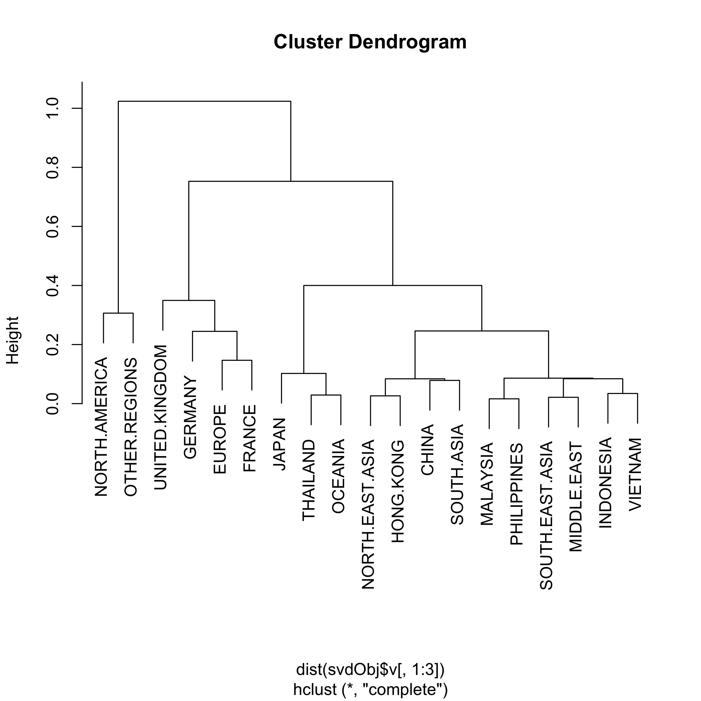 <center><p class="caption"><b>Fig:</b>: Applying Hierarchical Clustering on PCS</p></center>
